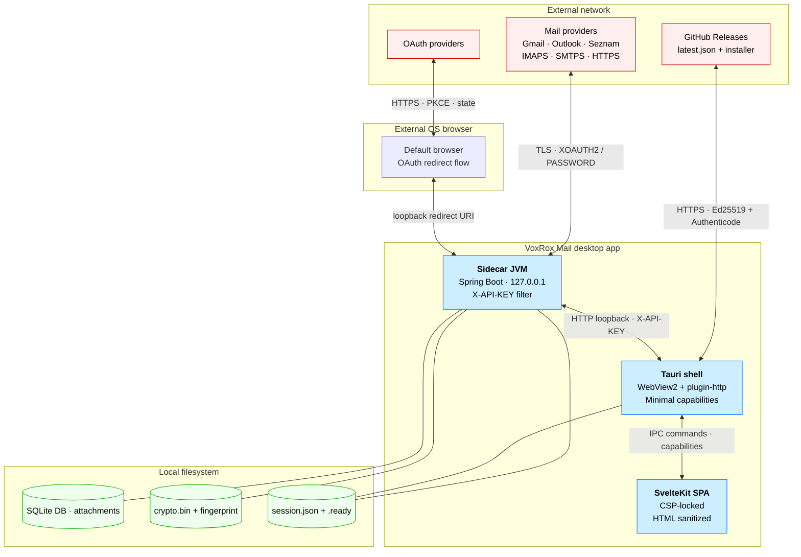

# VoxRox Mail — Threat Model

| | |
|---|---|
| **Version** | 1.9 |
| **Last revised** | 2026-07-09 |
| **Applies to** | VoxRox Mail V0.1.0 |
| **Status** | Active — read by PR reviewers when changes cross a trust boundary |

Single-source threat model for the VoxRox Mail desktop application. The
goal is to make every security-relevant decision in the codebase
traceable to (a) the asset it protects, (b) the threat it counters and
(c) the mitigation code path. Reviewers use this document as a
checklist when auditing changes that touch authentication, IPC, mail
content rendering, or the bundled sidecar.

V0.1.0 scope: single-user desktop client that talks to one or more
remote IMAP/SMTP servers (optionally via provider OAuth) and runs as a
Tauri WebView + bundled Spring Boot sidecar on Windows. macOS and Linux
builds inherit the same model but are not part of the V0.1.0 release.

## 1. Adversary model

Capabilities the threat model defends against:

| Adversary | Capability | Defended? |
|---|---|---|
| **Passive network observer** | Reads cleartext traffic on the user's LAN / hostile Wi-Fi. | Yes — TLS for all external traffic; loopback only for sidecar. |
| **Active network attacker (MITM)** | Modifies / spoofs IMAP/SMTP/OAuth traffic. | Yes — certificate validation, OAuth state nonce + PKCE, SSL guard for OAuth credentials. |
| **Unprivileged local process (same user)** | Reads the loopback port; tries to talk to the sidecar. | Yes — `X-API-KEY` filter + per-process random key, no TLS needed inside the user profile. |
| **Hostile mail content** | Email body with `<script>`, tracking pixels, `formaction` injection, SVG with `onload`. | Yes — `content-sanitizer.ts` is the chokepoint; 29 unit tests cover the matrix. |
| **Hostile updater feed** | Hijacks `latest.json` or installer download URL. | Yes — Tauri Ed25519 signature + Authenticode signature on the installer. |
| **Compromised dependency** | Malicious upstream package gets pulled into the build. | Partial — CodeQL + Dependabot + Trivy (planned via `vuln-scan.yml`). Build-time supply chain (signing key, CI runner) is out of scope. |

Capabilities **out of scope** (explicitly):

- Kernel / Administrator-level adversary on the same machine — at that level the encryption key, JVM memory, and Tauri IPC handles are observable.
- Adversary with physical access who can dump RAM or attach a debugger.
- Multi-profile Windows: the app installs per-user (`installMode: currentUser`), so each Windows profile gets its own install under `%LOCALAPPDATA%\Programs\VoxRox\Mail` and its own data under `%LOCALAPPDATA%\VoxRox\Mail`. One profile tampering with another profile's install or data is a same-machine cross-user adversary and is out of scope.
- Compromise of the Tauri Ed25519 signing key or the Anthropic / GitHub Actions runner used to build releases — this is a release-engineering procedure, not an in-app mitigation.

## 2. Assets

Severity uses C-I-A on a 4-step scale: Critical / High / Medium / Low.

| Asset | Where it lives | C | I | A |
|---|---|---|---|---|
| IMAP/SMTP passwords | Encrypted in `account_credentials.secret_encrypted` (AES/GCM via [CryptoService](backend/src/main/java/org/voxrox/mailbackend/core/security/CryptoService.java)) | **Crit** | High | Med |
| OAuth refresh tokens (Google, Microsoft) | Same column, same encryption | **Crit** | High | Med |
| OAuth access tokens (in-memory) | [TokenCache](backend/src/main/java/org/voxrox/mailbackend/feature/auth/service/TokenCache.java) — process memory only | High | Med | Low |
| Internal API key (sidecar ↔ frontend) | In-memory only, generated per JVM start; written to `session.json` only on local filesystem | High | High | Med |
| Crypto root key + salt | `crypto.bin` (Windows: DPAPI-protected, USER scope) + `crypto.fingerprint` in user data dir | **Crit** | **Crit** | High |
| User mail bodies & attachments | SQLite DB + temp files under user data dir; not encrypted at rest (accepted risk AR-1, §5) | Med | Med | Med |
| Contact list (addresses, names) | SQLite DB | Med | Med | Med |
| Tauri updater public key fingerprint | Hardcoded at build time | — | **Crit** | Low |

The "user data dir" is `%LOCALAPPDATA%\VoxRox\Mail` on Windows (or
`~/.voxrox/mail` for the bare-mvn dev fallback). It inherits the user
profile's filesystem ACLs; the threat model assumes those are intact
(no shared-machine without per-user profiles).

## 3. Trust boundaries

Trust boundary crossings (numbered, threats indexed below):

1. **External mail server ↔ sidecar** — IMAPS/SMTPS over TLS; XOAUTH2 SASL or plaintext PASSWORD-on-TLS.
2. **External OAuth provider ↔ external browser ↔ sidecar** — loopback redirect URI (`http://localhost/login/oauth2/code/<provider>`).
3. **Sidecar ↔ Tauri WebView (loopback HTTP)** — every request carries `X-API-KEY` derived from per-process random.
4. **Tauri WebView ↔ SvelteKit SPA** — IPC commands restricted by `frontend/src-tauri/capabilities/default.json`.
5. **Filesystem ↔ sidecar / Tauri** — encrypted credentials, plaintext DB, session handshake files.
6. **Tauri updater ↔ GitHub releases** — signed `latest.json` + signed installer.

## 4. STRIDE per boundary

Severity uses a CVSS-light rubric:

- **Critical** — direct asset compromise (credential leak, RCE, signing-key bypass)
- **High** — credential exposure under specific preconditions, persistent integrity loss
- **Medium** — transient data exposure, DoS recoverable by restart
- **Low** — UX degradation, log noise, theoretical exposure

### Boundary 1: external mail server

| ST | Threat | Vector | Severity | Mitigation |
|---|---|---|---|---|
| **S** | Spoofed mail server | Hostile DNS / MITM steers user to a fake IMAP server | High | TLS certificate validation (default JavaMail behaviour); the OAuth defense-in-depth `requireSslForOAuth2` in [SmtpTransportFactory.java](backend/src/main/java/org/voxrox/mailbackend/feature/mail/service/SmtpTransportFactory.java) blocks the access token from ever travelling over a plaintext SMTP socket |
| **T** | Mail tampered in transit | Active MITM modifies fetched mail | Medium | TLS as above; UID + UIDVALIDITY cross-check between fetches detects mailbox-level desync |
| **I** | Plaintext credentials over a downgraded connection | Forced STARTTLS strip | **Critical** | SSL/TLS enforcement; the IMAP probe in [MailConnectionProbe.java](backend/src/main/java/org/voxrox/mailbackend/feature/mail/service/MailConnectionProbe.java) rejects OAuth2 + non-SSL combination *before* opening the socket |
| **D** | Slow / unresponsive server hangs sidecar | Bad server / saturated link | Low | Per-protocol read & connection timeouts (60 s / 30 s for IMAP, 10 s / 15 s for SMTP) configured through `mail.imap.*` / `mail.smtp.*` properties — fixed in Phase 6.15 (the values used to be ignored by JavaMail) |
| **R / E** | — | Not applicable: read-only RX from this side. | — | — |

### Boundary 2: OAuth handshake

| ST | Threat | Vector | Severity | Mitigation |
|---|---|---|---|---|
| **S** | Stolen authorization code | Attacker redeems an intercepted code | High | PKCE (`code_challenge_method=S256`) for both Google and Microsoft (Spring Security default); state nonce |
| **T** | Phishing app posing as VoxRox Mail | Hostile redirect endpoint | Medium | Verified publisher (planned, blocker for Microsoft enterprise tenants — see todo:280); Google brand-verified consent screen; loopback redirect URI prevents redirect to a third-party host |
| **R** | User denies authorising the app | — | Low | Provider's own consent log + on-device `oauth_*` audit entries in `mail.log` |
| **I** | Refresh token leaks from disk | DB exfiltration | **Critical** | AES/GCM encryption with per-account derived key (PBKDF2, 600k iterations) — same path as for passwords |
| **D** | Provider revokes the registration | App-level outage | Medium | Explicit `requires_reauth` error code; the UI re-shows the OAuth wizard ([OAuth2TokenService](backend/src/main/java/org/voxrox/mailbackend/feature/auth/service/OAuth2TokenService.java)) |
| **E** | Excessive scopes granted | Backend asks for more than IMAP/SMTP | Medium | Scopes hard-coded per provider; no in-app scope escalation path |

### Boundary 3: sidecar HTTP API

| ST | Threat | Vector | Severity | Mitigation |
|---|---|---|---|---|
| **S** | Same-machine process spoofs the frontend | Sibling process sends HTTP requests to the sidecar | High | `ApiKeyFilter` rejects any request without `X-API-KEY`; the key lives in `session.json` which only the user profile can read (filesystem ACLs); key is regenerated on every JVM start |
| **T** | Tampered response (no TLS for loopback) | Local TLS strip | Low | Process-only loopback (127.0.0.1) and per-process API key make TLS unnecessary; CSP `connect-src` is locked to `http://localhost:* http://127.0.0.1:*` in [tauri.conf.json](frontend/src-tauri/tauri.conf.json) |
| **I** | SSRF / open redirect from the SPA | Malicious base URL persuades the SPA to leak the API key | High | `validateBackendBaseUrl` in `frontend/src/lib/api/session.ts` rejects any base URL that is not a numeric loopback host; the API key never goes anywhere else |
| **D** | A neighbouring process saturates the port | Port squatting / DoS | Low | Port is OS-assigned; failure leads to a clear `SessionLoadError` in the boot screen, not a hang (Phase 6.15) |
| **D** | Oversized JSON write-body exhausts the sidecar heap | Large `body` / many attachments on the JSON `send`/`draft` endpoints (not multipart, so `spring.servlet.multipart.*` does not apply) | Low | Per-field bean-validation caps on [MailRequest](backend/src/main/java/org/voxrox/mailbackend/feature/mail/dto/MailRequest.java) / [DraftRequest](backend/src/main/java/org/voxrox/mailbackend/feature/mail/dto/DraftRequest.java) (`body` ≤ 10 MiB, ≤ 50 attachments, ≤ 70 MB each) plus the client-enforced 25 MB total; same-user actor is out of scope (§1). Pre-deserialization aggregate bound is an accepted residual — see [docs/API_SURFACE_AUDIT.md](docs/API_SURFACE_AUDIT.md) finding A1 |
| **R / E** | — | The sidecar runs as the user; no privilege boundary to elevate across. | — | — |

### Boundary 4: WebView ↔ SPA

| ST | Threat | Vector | Severity | Mitigation |
|---|---|---|---|---|
| **T / I** | XSS in mail body | Malicious HTML in an email | **Critical** | [content-sanitizer.ts](frontend/src/lib/mail/content-sanitizer.ts) strips `<script>`, inline event handlers, `javascript:` / `data:` URLs (except whitelisted inline images), SVG `onload`, `formaction`, `srcdoc`; 29 unit tests cover the matrix (R3 audit). Defense-in-depth: even a missed vector cannot execute, because the body renders in an opaque-origin iframe (`sandbox="allow-scripts"`, **no** `allow-same-origin` → no access to the parent, cookies, storage, or same-origin network) carrying a `<meta>` CSP `default-src 'none'; script-src 'sha256-…'` that allows exactly ONE script — the hash-pinned first-party key forwarder ([mailFrame.ts](frontend/src/lib/mail/mailFrame.ts)). Any script in the mail body is blocked by the hash mismatch, so a missed sanitizer vector still cannot run. `allow-scripts` is enabled only so that forwarder can relay genuine (`isTrusted`) keystrokes **and body-link clicks** out via `postMessage` — the parent validates `event.origin === 'null'` + `event.source`, replays keystrokes as synthetic keydowns (restoring global shortcuts `?`, Delete), and opens a relayed link in the OS browser via `shell:allow-open` only after an `isOpenableMailLink` protocol allow-list (`http/https/mailto/tel`, mirroring the sanitizer) — the frame itself gains no navigation or popup capability ([MessageContent.svelte](frontend/src/lib/components/message-detail/MessageContent.svelte)) |
| **E** | Untrusted page invokes a Tauri command | Hostile content reaches the IPC bridge | High | Capabilities zeroed out in [capabilities/default.json](frontend/src-tauri/capabilities/default.json) to the minimum needed (`core:path:default`, `core:window:default`, `shell:allow-open`, `updater:allow-check`, `updater:allow-download-and-install`, plus the explicit `fs:*` / `http:*` allow lists and `shell:allow-spawn` / `shell:allow-kill` constrained to the `binaries/mail` sidecar with `args: false`). [lib.rs](frontend/src-tauri/src/lib.rs) registers **no** hand-written `#[tauri::command]` and **no** `invoke_handler` — the entire native surface is official plugins bound by these capabilities, so there is zero bespoke IPC to audit. The in-app HTTP plugin is loopback-only (`http:default` allows `localhost`/`127.0.0.1` only) and built without a cookie jar |
| **I** | Inline images exfiltrate via tracking pixels | Remote image as user fingerprint | Medium | Remote images are **blocked by default**: a live remote `src` survives neither sanitizer layer — the backend keeps an `https` URL only as the inert `data-voxrox-remote-src` attribute ([HtmlSanitizer.java](backend/src/main/java/org/voxrox/mailbackend/util/HtmlSanitizer.java)) and drops cleartext `http` entirely; [content-sanitizer.ts](frontend/src/lib/mail/content-sanitizer.ts) re-validates the inert carrier and only inline `data:image/*;base64` renders. Reinforced by the body frame's `<meta>` CSP `img-src data:` and its opaque-origin `sandbox="allow-scripts"` ([mailFrame.ts](frontend/src/lib/mail/mailFrame.ts)). Loading is an explicit per-message / per-sender **opt-in** (v1.6): the gesture promotes the inert attribute to `src` and relaxes the frame CSP to `img-src data: https:` under a `no-referrer` meta — a user-initiated, image-only exposure (never trust or code execution), matching mature clients |
| **S / D / R** | — | Sandboxed Webview; no spoofing path from a single SPA origin. | — | — |

### Boundary 5: local filesystem

| ST | Threat | Vector | Severity | Mitigation |
|---|---|---|---|---|
| **T** | crypto.bin tampered | An attacker who can write to the user profile flips bytes | **Critical** | Fingerprint file checked on every start ([StorageContextInitializer.java](backend/src/main/java/org/voxrox/mailbackend/core/init/StorageContextInitializer.java)); mismatch hard-stops the app. On Windows a tampered DPAPI blob also fails closed at `unprotect` (boot aborts, never falls back to plaintext) |
| **I** | crypto.bin copied off-machine to decrypt credentials | A backup tool or attacker grabs the whole data dir | High | Windows: `crypto.bin` is DPAPI-protected in USER scope + app entropy ([WindowsDpapiSecretStore](backend/src/main/java/org/voxrox/mailbackend/core/security/secret/WindowsDpapiSecretStore.java)) — a copy under another user/machine cannot be unprotected, so the AES/GCM credentials column stays sealed. Mail bodies in `mail.db` remain plaintext (DB is not encrypted at rest) |
| **I** | Other-user read on multi-profile Windows | Shared `%LOCALAPPDATA%` (rare) | High | Out of scope — the threat model assumes per-user profiles with default ACLs |
| **D** | Disk full, missing permissions | Storage failure | Medium | Pre-migration backup gate; clear error state in the boot screen ("backup-pre-v*" snapshot exists) |
| **S / R / E** | — | Filesystem is the user; no spoofing primitive. | — | — |

### Boundary 6: Tauri updater

| ST | Threat | Vector | Severity | Mitigation |
|---|---|---|---|---|
| **T** | Tampered installer | Modified `voxrox-mail-*-setup.exe` served from a hostile host | **Critical** | Tauri Ed25519 signature verification (public key bundled in the running app); Authenticode signature on the installer for OS-level reputation; `latest.json` over HTTPS. Audited 2026-07-09 — [docs/UPDATER_AUDIT.md](docs/UPDATER_AUDIT.md): verification is native (no JS bypass), the build fail-closes on a missing pubkey/signing key, and the attacker-shapeable `latest.json` `notes`/`version` fields are never rendered as markup |
| **E** | Malicious package replaces the sidecar | Hostile installer, or same-user malware overwriting the installed binary | **Critical** | Update packages carry the Ed25519 update signature + Sigstore build-provenance attestation (+ Authenticode when a cert is present). Under `installMode: currentUser` the installed sidecar sits in a user-writable dir, so same-user malware can replace it **without elevation** — accepted as **AR-2**: a same-user attacker already reads the unencrypted `mail.db` in the same profile (AR-1), so gating the binary behind elevation adds little, and it was traded for elevation-free auto-updates |
| **D** | Bad release published | Updater fetches a broken build | Medium | `allowDowngrades: false` plus the manual override path in OPERATIONS.md |
| **S / I / R** | — | Update channel is signed and observable. | — | — |

## 5. Accepted residual risks

Risks consciously accepted for a given release rather than mitigated in
code. Each is re-evaluated per release; an entry leaving this table means
either the risk was closed in code or the product decided it is no longer
acceptable.

| # | Risk | Residual exposure | Why accepted (V0.1.0) | Mitigation / upgrade path |
|---|---|---|---|---|
| **AR-1** | Mail DB not encrypted at rest | An adversary with **offline access to the powered-off disk** (lost/stolen device, a copied backup of the data dir) can read all cached mail bodies, subjects, senders and contacts straight from `db/mail.db`. Credentials and OAuth tokens stay sealed (DPAPI). The same-user-while-logged-in adversary is already out of scope (§1). | Column-level encryption is incompatible with the FTS5 search index + `ORDER BY` over subject/sender/received_at ([V1__init.sql](backend/src/main/resources/db/migration/V1__init.sql)); whole-DB encryption (SQLCipher) was deferred to keep the audited SQLite core and the release scope stable. The asset is rated Med/Med/Med (§2). | **Now:** OS full-disk encryption (BitLocker) + per-user filesystem ACLs — documented for end users in [PRIVACY.md](PRIVACY.md) and the end-user README, and recorded as a decision in `todo.md`. **Upgrade path:** SQLCipher via the drop-in `Willena/sqlite-jdbc-crypt` fork (Apache 2.0, native libs bundled per OS), with the DB key sealed by the existing `SecretStore`/DPAPI — this raises mail bodies to the *same* at-rest protection credentials already have, and keeps schema, FTS5 and the sync core unchanged. |
| **AR-2** | Installed app binaries are user-writable (per-user install) | Malware running at the victim's **own privilege level** can overwrite the installed sidecar / app executable in `%LOCALAPPDATA%\Programs\VoxRox\Mail` **without elevation**, so its code runs with the user's rights on next launch. A cross-user or admin adversary is already out of scope (§1). | `installMode: currentUser` was chosen so the Tauri auto-updater installs updates **without a UAC prompt** — `perMachine` forces elevation on every update and blocks standard-user auto-update. The updater is the one path that cannot be fixed after a bad ship, so its reliability was prioritized. The marginal integrity loss is bounded: an attacker already at the user's privilege level can read the unencrypted `mail.db` (AR-1) and keylog the session, so requiring elevation only to swap the binary raises the bar little. Assets rated Med (§2). | **Now:** OS full-disk encryption (BitLocker) + per-user ACLs on `%LOCALAPPDATA%` (same standing mitigation as AR-1). **Upgrade path:** verify the sidecar's integrity at launch (bundled Authenticode signature or a pinned hash) before spawning it, and/or move back to an elevation-gated `perMachine` install if a paid code-signing cert plus a silent-elevation update story land. |

## 6. Review checklist for PR authors

When touching code that crosses one of the boundaries above:

- [ ] If the change reads or writes credentials, it goes through `CryptoService` and never logs the plaintext.
- [ ] If the change adds a new IPC command or Tauri permission, it appears in `capabilities/default.json` with a justification.
- [ ] If the change renders user-supplied HTML, it runs through `sanitizeMailHtml()` ([content-sanitizer.ts](frontend/src/lib/mail/content-sanitizer.ts)) **and** is rendered only inside the opaque-origin body iframe built by [mailFrame.ts](frontend/src/lib/mail/mailFrame.ts) (`sandbox="allow-scripts"` with no `allow-same-origin`, `<meta>` CSP `default-src 'none'; script-src 'sha256-…'` pinning only the key forwarder), or an equivalent pure transform.
- [ ] If the change adds an outbound network call from the SPA, the host appears in the CSP `connect-src` allow list and there is a reason it cannot use the existing loopback API.
- [ ] If the change touches the OAuth flow, redirect URIs in `application.properties` match the provider registration verbatim.
- [ ] If the change touches the boot / handshake path, stale `.ready` and `session.json` are cleared before the new sidecar starts.

## 7. Change log

| Version | Date | Summary |
|---|---|---|
| 1.0 | 2026-06-02 | Initial document — V0.1.0 baseline; covers 6 boundaries × STRIDE matrix with CVSS-light severity; Mermaid diagram; adversary model. |
| 1.1 | 2026-06-07 | Added §5 "Accepted residual risks": formalized the plaintext mail-DB-at-rest decision (AR-1) with BitLocker as the standing mitigation and SQLCipher (drop-in `Willena/sqlite-jdbc-crypt`, DB key under DPAPI) as the documented upgrade path. |
| 1.2 | 2026-06-13 | Tauri capability/CSP/IPC audit — trued §4 Boundary 4 to the shipping code: documented the sidecar-scoped `shell:allow-spawn`/`shell:allow-kill` (`args: false`) and the zero-custom-command finding in [lib.rs](frontend/src-tauri/src/lib.rs); corrected the tracking-pixel mitigation (remote images are unconditionally stripped — the previously documented per-sender "UI toggle" does not exist) and recorded the `sandbox=""` body-iframe + per-frame CSP as the defense-in-depth layer; fixed the stale `sanitizeMessageHtml()` reference to `sanitizeMailHtml()`. No code change — posture confirmed strong; optional global-CSP tightening (`script-src 'self'`, drop unused `customprotocol:`) deferred to the release smoke. |
| 1.3 | 2026-06-24 | Boundary 4 mail-body frame reworked to unblock keyboard shortcuts without weakening isolation ([mailFrame.ts](frontend/src/lib/mail/mailFrame.ts)). A pure `sandbox=""` frame is a keyboard black hole — `?`, Delete, etc. pressed while the reader's focus is inside the body never reach the app. Replaced with `sandbox="allow-scripts"` (still **no** `allow-same-origin` → opaque origin, no parent/cookie/storage/network access) + an in-`srcdoc` `<meta>` CSP `default-src 'none'; img-src data:; script-src 'sha256-…'` that hash-pins exactly one first-party key forwarder; all mail-body scripts remain blocked by hash mismatch (a stricter, reliably-enforced replacement for the previously dropped `csp` *attribute*, which WebView2/Chromium barely supports). The forwarder relays only `isTrusted` keystrokes via `postMessage`; the parent validates `event.source` and replays them as synthetic keydowns. Net posture: mail body still cannot run its own code or reach anything outside the opaque frame; new surface is one validated keystroke-relay path. Covered by `mailFrame.test.ts` (hash pin) + `shortcuts.functional.e2e.ts` (in-body `?`/Delete). |
| 1.4 | 2026-07-07 | Windows install switched from `installMode: perMachine` to `currentUser` so the Tauri auto-updater installs updates without a UAC prompt (perMachine forces elevation on every update, blocking standard-user auto-update — and the updater is unfixable-after-ship, so its reliability was prioritized). Per-user binaries now live under `%LOCALAPPDATA%\Programs\VoxRox\Mail`, kept separate from runtime data in `%LOCALAPPDATA%\VoxRox\Mail`. Threat E (Boundary 6) re-scored: the installed sidecar is now user-writable (no elevation to replace); accepted as new residual **AR-2**, bounded by the fact that a same-user attacker already reads the unencrypted DB (AR-1). Updated the multi-profile out-of-scope note in §1 to the per-user install reality. |
| 1.5 | 2026-07-08 | Boundary 4 re-audited pre-V0.1.0 — verdict **PASS**, see [docs/CONTENT_RENDERING_AUDIT.md](docs/CONTENT_RENDERING_AUDIT.md) (triple-layer chokepoint confirmed; no `{@html}` / no `innerHTML` sinks; sanitizer has no unprotected consumer). Fixed audit finding **F1**: mail-body links were dead — the opaque `sandbox="allow-scripts"` frame has no `allow-popups`, so the sanitizer-forced `target="_blank"` links could not open and there was no bridge. The hash-pinned forwarder now also relays `isTrusted` anchor clicks (`preventDefault` + `postMessage`); the parent opens them via `shell:allow-open` after an `isOpenableMailLink` protocol allow-list. Sandbox/CSP unchanged (hash recomputed); covered by [links.functional.e2e.ts](frontend/src/routes/mail/links.functional.e2e.ts). Also fixed **F2**: embedded `cid:` images now inline to `data:` server-side (`MimePartExtractor.collectInlineImages` → `HtmlSanitizer.sanitize(html, inlineImages)`), **raster-only** (SVG excluded) and **size-capped** (2 MiB/image, 8 MiB/message) to bound `content`-column growth — so embedded logos/newsletter graphics render (matching Outlook/Gmail/Thunderbird) while remote images stay blocked (no network, no tracking-pixel exposure). The remote-image opt-in (block-by-default + explicit per-message gesture) is deferred post-beta. |
| 1.6 | 2026-07-08 | Boundary 4 — remote-image **opt-in** shipped (audit F2 remaining), plus F3 plain-text fidelity. Remote images stay **blocked by default**; a remote **https** URL is now preserved inertly in `data-voxrox-remote-src` (never a live `src` in stored content — inert at rest), while `http` (cleartext) images are still dropped entirely. The frame `img-src` relaxes from `data:` to `data: https:` **only** under an explicit per-message "load images" gesture ([MessageContent.svelte](frontend/src/lib/components/message-detail/MessageContent.svelte) banner → [mailFrame.ts](frontend/src/lib/mail/mailFrame.ts) promotes `data-voxrox-remote-src` → `src`); a `no-referrer` meta prevents referrer leakage on load. `script-src`/`style-src`/`default-src`, the opaque-origin sandbox, and the hash-pinned forwarder are **unchanged**. A per-account allow-list (`remote_image_sender` + `/api/v1/remote-images/allowlist`) supports "always trust this sender" — keyed on the **spoofable** `From` and affecting **image loading only**, never trust or code execution (accepted convenience trade-off, same as mature clients). F3: genuine `text/plain` bodies are now HTML-escaped and `<pre>`-wrapped (`HtmlSanitizer.escapePlainText`) instead of parsed as HTML, so literal `<...>` renders verbatim. Covered by `HtmlSanitizerTest`, `mailFrame.test.ts`, `content-sanitizer` tests, `RemoteImageAllowlist*` tests and [remote-images.functional.e2e.ts](frontend/src/routes/mail/remote-images.functional.e2e.ts). |
| 1.7 | 2026-07-09 | Boundary 3 (sidecar HTTP API) audited pre-V0.1.0 — verdict **PASS**, see [docs/API_SURFACE_AUDIT.md](docs/API_SURFACE_AUDIT.md). Confirmed: constant-time `X-API-KEY` chokepoint + `anyRequest().authenticated()` default-deny (`/api/internal/**` behind the key); comprehensive input validation across the 15 controllers — every parameter-taking one is `@Validated` (count corrected in v1.9; the audit doc's v1.1 change log has the detail); catch-all error handler leaks no message/stack (`include-message/stacktrace=never`); attachment `partPath` is a MIME index (no filesystem path / traversal), temp files unlinked on close; diagnostic dump carries no credentials/tokens/bodies (email masked, `lastError` reduced to a boolean). Fixed finding **A1** (Low, defense-in-depth): the JSON `send`/`draft` endpoints had no `body` length or attachment-count cap, and the per-attachment `@Size` runs only post-Jackson — added `body` ≤ 10 MiB + ≤ 50 attachments caps on `MailRequest`/`DraftRequest` (regression-tested); pre-deserialization aggregate bound documented as an accepted residual (loopback + authenticated + client 25 MB cap). Added the corresponding Boundary 3 `D` row. |
| 1.8 | 2026-07-09 | Boundary 6 (Tauri auto-updater) audited pre-V0.1.0 — verdict **PASS**, no code change, see [docs/UPDATER_AUDIT.md](docs/UPDATER_AUDIT.md). Confirmed: Ed25519 verification is native in the Rust plugin (no JS-side bypass; only `check` + `download-and-install` capabilities granted); the release build fail-closes on a missing `TAURI_UPDATER_PUBKEY` (`requireEnv`) or `TAURI_SIGNING_PRIVATE_KEY`, transport is HTTPS-only (`dangerousInsecureTransportProtocol` opt-in and unset), `allowDowngrades:false`; the manifest generator only picks a signed artifact and throws on an empty `.sig`; a hijacked `latest.json` cannot install a forged binary (signature mismatch aborts) and its `notes`/`version` fields are never rendered as markup (no `{@html}`, version is i18n text-escaped); startup check fails silently, manual check surfaces a failure UI with a releases-page fallback. Two procedural notes (base-config updater block is a dev reference guarded only by RELEASE_CHECKLIST; a CI lint could assert `dangerousInsecureTransportProtocol` is never set). Added the audit reference to the Boundary 6 `T` row. |
| 1.9 | 2026-07-09 | Documentation truing pass (no threat or mitigation changes): Boundary 4 `I` row updated to the shipped remote-image opt-in posture (v1.6) — the pre-F2 "no toggle / no opt-in exfil path" wording no longer described the code; v1.7 entry's controller count corrected (15 controllers = 12 public + 3 `/api/internal`, every parameter-taking one `@Validated` — detail in [docs/API_SURFACE_AUDIT.md](docs/API_SURFACE_AUDIT.md) v1.1 change log); change-log rows reordered chronologically. Companion doc updates: CONTENT_RENDERING_AUDIT.md v1.1 (§1/§2 trued to F2), API_SURFACE_AUDIT.md v1.2 (Boundary 2/5 coverage claim corrected), SECURITY_RELEASE_CHECK.md (controller count + resolved SBOM-scan items ticked). |

## 8. References

- [SECURITY.md](SECURITY.md) — disclosure process for vulnerabilities.
- [backend/SECURITY_RELEASE_CHECK.md](backend/SECURITY_RELEASE_CHECK.md) — per-release security audit checklist.
- [PRIVACY.md](PRIVACY.md) / [PRIVACY.en.md](PRIVACY.en.md) — what data is stored where.
- [OPERATIONS.md](backend/OPERATIONS.md) — recovery procedures (backup restore, crypto rotation).
- [SECURITY_RELEASE_CHECK.md](backend/SECURITY_RELEASE_CHECK.md) — pre-release security gate.
