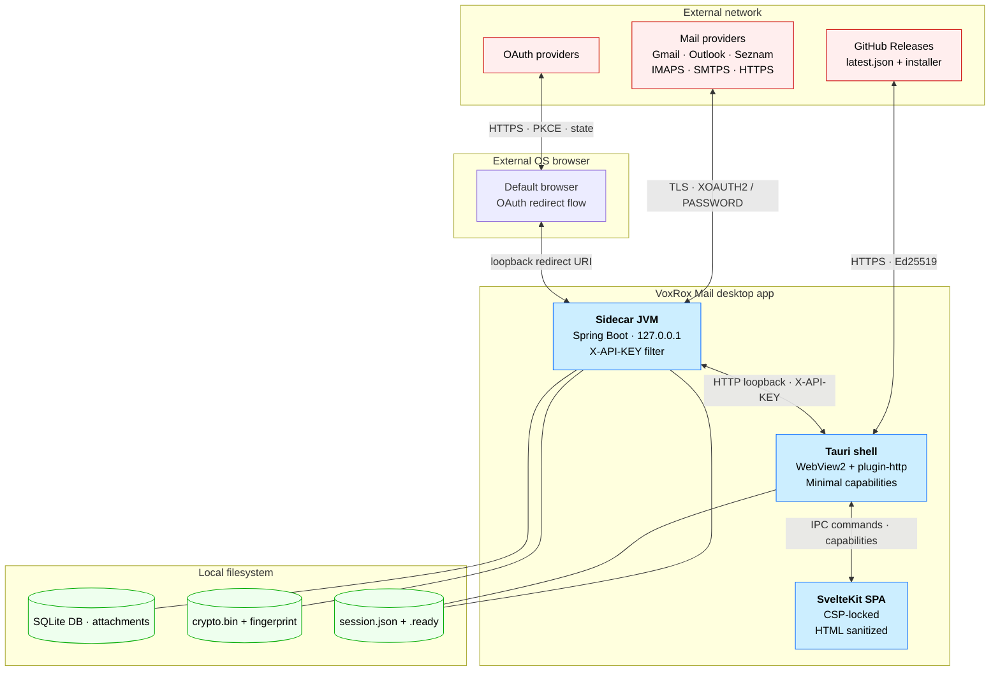

# VoxRox Mail — Threat Model

|                  |                                                                   |
| ---------------- | ----------------------------------------------------------------- |
| **Version**      | 2.79                                                              |
| **Last revised** | 2026-10-05                                                        |
| **Applies to**   | VoxRox Mail V0.1.0                                                |
| **Status**       | Active — read by PR reviewers when changes cross a trust boundary |

Single-source threat model for the VoxRox Mail desktop application. The
goal is to make every security-relevant decision in the codebase
traceable to (a) the asset it protects, (b) the threat it counters and
(c) the mitigation code path. Reviewers use this document as a
checklist when auditing changes that touch authentication, IPC, mail
content rendering, or the bundled sidecar.

V0.1.0 scope: single-user desktop client that talks to one or more
remote IMAP/SMTP servers (optionally via provider OAuth) and runs as a
Tauri WebView + bundled Spring Boot sidecar on Windows. macOS and Linux
builds inherit the same model but are not part of the V0.1.0 release.

## 1. Adversary model

Capabilities the threat model defends against:

| Adversary                                  | Capability                                                                              | Defended?                                                                                                                              |
| ------------------------------------------ | --------------------------------------------------------------------------------------- | -------------------------------------------------------------------------------------------------------------------------------------- |
| **Passive network observer**               | Reads cleartext traffic on the user's LAN / hostile Wi-Fi.                              | Yes — TLS for all external traffic; loopback only for sidecar.                                                                         |
| **Active network attacker (MITM)**         | Modifies / spoofs IMAP/SMTP/OAuth traffic.                                              | Yes — certificate validation, OAuth state nonce + PKCE, SSL guard for OAuth credentials.                                               |
| **Unprivileged local process (same user)** | Reads the loopback port; tries to talk to the sidecar.                                  | Yes — `X-API-KEY` filter + per-process random key, no TLS needed inside the user profile.                                              |
| **Hostile mail content**                   | Email body with `<script>`, tracking pixels, `formaction` injection, SVG with `onload`. | Yes — `content-sanitizer.ts` is the chokepoint; 29 unit tests cover the matrix.                                                        |
| **Hostile updater feed**                   | Hijacks `latest.json` or installer download URL.                                        | Yes — Tauri Ed25519 signature on the update package. The installer itself is not Authenticode-signed (see AR-4).                       |
| **Compromised dependency**                 | Malicious upstream package gets pulled into the build.                                  | Partial — CodeQL + Dependabot + Trivy (planned via `vuln-scan.yml`). Build-time supply chain (signing key, CI runner) is out of scope. |

Capabilities **out of scope** (explicitly):

- Kernel / Administrator-level adversary on the same machine — at that level the encryption key, JVM memory, and Tauri IPC handles are observable.
- Adversary with physical access who can dump RAM or attach a debugger.
- Multi-profile Windows: the app installs per-user (`installMode: currentUser`), so each Windows profile gets its own install under `%LOCALAPPDATA%\Programs\VoxRox\Mail` and its own data under `%LOCALAPPDATA%\VoxRox\Mail`. One profile tampering with another profile's install or data is a same-machine cross-user adversary and is out of scope.
- Compromise of the Tauri Ed25519 signing key or the Anthropic / GitHub Actions runner used to build releases — this is a release-engineering procedure, not an in-app mitigation.

## 2. Assets

Severity uses C-I-A on a 4-step scale: Critical / High / Medium / Low.

| Asset                                    | Where it lives                                                                                                                                                   | C        | I        | A    |
| ---------------------------------------- | ---------------------------------------------------------------------------------------------------------------------------------------------------------------- | -------- | -------- | ---- |
| IMAP/SMTP passwords                      | Encrypted in `account_credentials.secret_encrypted` (AES/GCM via [CryptoService](backend/src/main/java/org/voxrox/mailbackend/core/security/CryptoService.java)) | **Crit** | High     | Med  |
| OAuth refresh tokens (Google, Microsoft) | Same column, same encryption                                                                                                                                     | **Crit** | High     | Med  |
| OAuth access tokens (in-memory)          | [TokenCache](backend/src/main/java/org/voxrox/mailbackend/feature/auth/service/TokenCache.java) — process memory only                                            | High     | Med      | Low  |
| Internal API key (sidecar ↔ frontend)    | In-memory only, generated per JVM start; written to `session.json` only on local filesystem                                                                      | High     | High     | Med  |
| Crypto root key + salt                   | `crypto.bin` (Windows: DPAPI-protected, USER scope) + `crypto.fingerprint` in user data dir                                                                      | **Crit** | **Crit** | High |
| User mail bodies & attachments           | SQLite DB + temp files under user data dir; not encrypted at rest (accepted risk AR-1, §5)                                                                       | Med      | Med      | Med  |
| Contact list (addresses, names)          | SQLite DB                                                                                                                                                        | Med      | Med      | Med  |
| Tauri updater public key fingerprint     | Hardcoded at build time                                                                                                                                          | —        | **Crit** | Low  |

The "user data dir" is `%LOCALAPPDATA%\VoxRox\Mail` on Windows (or
`~/.voxrox/mail` for the bare-mvn dev fallback). It inherits the user
profile's filesystem ACLs; the threat model assumes those are intact
(no shared-machine without per-user profiles).

## 3. Trust boundaries

```mermaid
flowchart TB
    subgraph EXT["External network"]
        MAIL[Mail providers<br/>Gmail · Outlook · Seznam<br/>IMAPS · SMTPS · HTTPS]
        OAUTH[OAuth providers]
        UPD[GitHub Releases<br/>latest.json + installer]
    end

    subgraph BROWSER["External OS browser"]
        BR[Default browser<br/>OAuth redirect flow]
    end

    subgraph DESKTOP["VoxRox Mail desktop app"]
        SIDECAR["<b>Sidecar JVM</b><br/>Spring Boot · 127.0.0.1<br/>X-API-KEY filter"]
        TAURI["<b>Tauri shell</b><br/>WebView2 + plugin-http<br/>Minimal capabilities"]
        SPA["<b>SvelteKit SPA</b><br/>CSP-locked<br/>HTML sanitized"]
    end

    subgraph FS["Local filesystem"]
        DB[(SQLite DB · attachments)]
        CRYPTO[(crypto.bin + fingerprint)]
        SESSION[(session.json + .ready)]
    end

    MAIL <-->|TLS · XOAUTH2 / PASSWORD| SIDECAR
    OAUTH <-->|HTTPS · PKCE · state| BR
    BR <-->|loopback redirect URI| SIDECAR
    UPD <-->|HTTPS · Ed25519| TAURI

    SIDECAR <-->|HTTP loopback · X-API-KEY| TAURI
    TAURI <-->|IPC commands · capabilities| SPA

    SIDECAR --- CRYPTO
    SIDECAR --- DB
    SIDECAR --- SESSION
    TAURI --- SESSION

    classDef ext fill:#fee,stroke:#c00,color:#000
    classDef app fill:#cef,stroke:#06f,color:#000
    classDef fs fill:#efe,stroke:#0a0,color:#000
    class MAIL,OAUTH,UPD ext
    class SIDECAR,TAURI,SPA app
    class DB,CRYPTO,SESSION fs
```

Trust boundary crossings (numbered, threats indexed below):

1. **External mail server ↔ sidecar** — IMAPS or SMTPS, or IMAP or SMTP with required STARTTLS; XOAUTH2 SASL or PASSWORD, always over TLS (B1-4, fixed 2026-09-22).
2. **External OAuth provider ↔ external browser ↔ sidecar** — loopback redirect URI (`http://localhost/login/oauth2/code/<provider>`).
3. **Sidecar ↔ Tauri WebView (loopback HTTP)** — every request carries `X-API-KEY` derived from per-process random.
4. **Tauri WebView ↔ SvelteKit SPA** — IPC commands restricted by `frontend/src-tauri/capabilities/default.json`.
5. **Filesystem ↔ sidecar / Tauri** — encrypted credentials, plaintext DB, session handshake files.
6. **Tauri updater ↔ GitHub releases** — signed `latest.json` + signed installer.

## 4. STRIDE per boundary

Severity uses a CVSS-light rubric:

- **Critical** — direct asset compromise (credential leak, RCE, signing-key bypass)
- **High** — credential exposure under specific preconditions, persistent integrity loss
- **Medium** — transient data exposure, DoS recoverable by restart
- **Low** — UX degradation, log noise, theoretical exposure

### Boundary 1: external mail server

Audited 2026-07-09 (full tier), last re-verified 2026-10-05 against `c386fed` — verdict **open findings**,
see [docs/IMAP_SMTP_AUDIT.md](docs/IMAP_SMTP_AUDIT.md). Of its two earlier Medium
DoS gaps, B1-1 (unbounded body fetch) was briefly carried as accepted residual
AR-3 and **closed in code on 2026-07-10** — the body read is now byte-capped
(see the D rows) — and B1-2 (quadratic subject normalization) was fixed on
2026-08-08. The 1.9 re-verification found four more: B1-4 (High, IMAP
cleartext login) and B1-3 (Medium, a server-stated size exhausting the heap)
were fixed on 2026-09-22, B1-5 (Medium, a draft sent as the server holds it)
on the same day with a residual, and B1-6 (Low, no IMAP write timeout) on
2026-09-23. Fixing B1-3 found B1-7 (Medium, a declared literal size), fixed the
same day. The 1.16 re-verification found five more and reopened one: B1-8
(Medium, a command's responses adding up past the per-response bounds),
B1-9 (Medium, the lazy page fetch), B1-10 (Medium, a recursive
`BODYSTRUCTURE` parse), B1-12 (Medium, a text part read whole on download),
B1-11 (Low), and B1-5, whose recipient
check read a row the server can make the sync rewrite. B1-10, B1-12, B1-11,
B1-5, B1-9 and B1-8 were fixed on 2026-09-28. The 1.24 verification pass then
reopened B1-5, B1-8, B1-10, B1-11 and B1-12 and found B1-13 (Medium, the cost of
an EXPUNGE). B1-8, B1-13 and B1-10 were fixed the same day, and fixing B1-8
found B1-14 (Medium, what an open folder keeps from its commands' FETCH
responses); B1-11 and B1-5 were fixed again on 2026-10-04. The 1.31 verification
pass then reopened B1-10 and B1-5, and B1-10 was fixed again on 2026-10-05. The 1.33 verification pass confirmed that fix and found B1-15 (Medium, an unbounded loop in Angus's body-extension parse); B1-12 was fixed again and B1-15 fixed the same day, and B1-5 fixed again after them. The 1.40 re-verification confirmed those fixes and found one more route around B1-5's bound, fixed the same day, and the pass over that fix reopened B1-5 at 1.41, for the order in which a save finds its draft's chain and for the write of its entry, so two are open. Each is in the row it belongs to below.

| ST        | Threat                                                            | Vector                                                                                                                                                                                                                                                                                                                                                                                                                                                                                                                                                                                                                                                                  | Severity     | Mitigation                                                                                                                                                                                                                                                                                                                                                                                                                                                                                                                                                                                                                                                                                                                                                                                                                                                                                                                                                                                                                                                                                                                                                                                                                                                                                                                                                                                                                                                                                                                                                                                                                                                                                                                                                                                                                                                                                                                                                                                                                                                                                                                                                                                                                                                                                                                                                                                                                                                                                                                                                                                                                                                                                                                                                                                                                                                                                                                                                                            |
| --------- | ----------------------------------------------------------------- | ----------------------------------------------------------------------------------------------------------------------------------------------------------------------------------------------------------------------------------------------------------------------------------------------------------------------------------------------------------------------------------------------------------------------------------------------------------------------------------------------------------------------------------------------------------------------------------------------------------------------------------------------------------------------- | ------------ | ------------------------------------------------------------------------------------------------------------------------------------------------------------------------------------------------------------------------------------------------------------------------------------------------------------------------------------------------------------------------------------------------------------------------------------------------------------------------------------------------------------------------------------------------------------------------------------------------------------------------------------------------------------------------------------------------------------------------------------------------------------------------------------------------------------------------------------------------------------------------------------------------------------------------------------------------------------------------------------------------------------------------------------------------------------------------------------------------------------------------------------------------------------------------------------------------------------------------------------------------------------------------------------------------------------------------------------------------------------------------------------------------------------------------------------------------------------------------------------------------------------------------------------------------------------------------------------------------------------------------------------------------------------------------------------------------------------------------------------------------------------------------------------------------------------------------------------------------------------------------------------------------------------------------------------------------------------------------------------------------------------------------------------------------------------------------------------------------------------------------------------------------------------------------------------------------------------------------------------------------------------------------------------------------------------------------------------------------------------------------------------------------------------------------------------------------------------------------------------------------------------------------------------------------------------------------------------------------------------------------------------------------------------------------------------------------------------------------------------------------------------------------------------------------------------------------------------------------------------------------------------------------------------------------------------------------------------------------------------- |
| **S**     | Spoofed mail server                                               | Hostile DNS / MITM steers user to a fake IMAP server                                                                                                                                                                                                                                                                                                                                                                                                                                                                                                                                                                                                                    | High         | TLS certificate validation with explicit `ssl.checkserveridentity=true` on the IMAP store, SMTP transport and credential probe (not left to the JavaMail default), on every connection, all of which are TLS since the B1-4 fix (IMAP without implicit SSL uses required STARTTLS); the OAuth defense-in-depth blocks the access token from ever travelling over a plaintext socket — SMTP via `requireSslForOAuth2` in [SmtpTransportFactory.java](backend/src/main/java/org/voxrox/mailbackend/feature/mail/service/SmtpTransportFactory.java), IMAP via the fail-fast CRITICAL `imap_oauth2_plaintext_blocked` guard in [ImapConnectionManager.java](backend/src/main/java/org/voxrox/mailbackend/feature/mail/service/ImapConnectionManager.java)                                                                                                                                                                                                                                                                                                                                                                                                                                                                                                                                                                                                                                                                                                                                                                                                                                                                                                                                                                                                                                                                                                                                                                                                                                                                                                                                                                                                                                                                                                                                                                                                                                                                                                                                                                                                                                                                                                                                                                                                                                                                                                                                                                                                                                 |
| **T**     | Mail tampered in transit                                          | Active MITM modifies fetched mail                                                                                                                                                                                                                                                                                                                                                                                                                                                                                                                                                                                                                                       | Medium       | TLS as above; UID + UIDVALIDITY cross-check detects mailbox-level desync at the start of each sync cycle ([FlagSyncService.java](backend/src/main/java/org/voxrox/mailbackend/feature/mail/service/FlagSyncService.java) resets sync state on a UIDVALIDITY change); user-initiated UID operations between cycles do not re-check it (audit §3, Low)                                                                                                                                                                                                                                                                                                                                                                                                                                                                                                                                                                                                                                                                                                                                                                                                                                                                                                                                                                                                                                                                                                                                                                                                                                                                                                                                                                                                                                                                                                                                                                                                                                                                                                                                                                                                                                                                                                                                                                                                                                                                                                                                                                                                                                                                                                                                                                                                                                                                                                                                                                                                                                  |
| **I**     | Plaintext credentials over a downgraded connection                | Forced STARTTLS strip                                                                                                                                                                                                                                                                                                                                                                                                                                                                                                                                                                                                                                                   | **Critical** | SSL/TLS enforcement on both protocols: without implicit SSL, STARTTLS is required — for IMAP since the B1-4 fix (2026-09-22, audit §4d), for SMTP by `mail.smtp.starttls.required=true` (a stripped upgrade fails, never sends cleartext); the IMAP probe in [MailConnectionProbe.java](backend/src/main/java/org/voxrox/mailbackend/feature/mail/service/MailConnectionProbe.java) rejects OAuth2 + non-SSL combination _before_ opening the socket                                                                                                                                                                                                                                                                                                                                                                                                                                                                                                                                                                                                                                                                                                                                                                                                                                                                                                                                                                                                                                                                                                                                                                                                                                                                                                                                                                                                                                                                                                                                                                                                                                                                                                                                                                                                                                                                                                                                                                                                                                                                                                                                                                                                                                                                                                                                                                                                                                                                                                                                  |
| **D**     | Slow / unresponsive server hangs sidecar                          | Bad server / saturated link                                                                                                                                                                                                                                                                                                                                                                                                                                                                                                                                                                                                                                             | Low          | Per-protocol read & connection timeouts (60 s / 30 s for IMAP, connect 30 s for SMTP) configured through `mail.client.imap.*` / `mail.client.smtp.*` in `application.properties` (not the binding record's `@DefaultValue`, which for SMTP connect is a shorter 15 s); the SMTP read timeout has no key there and runs at its record default of 10 s. IMAP sets a write timeout too since the B1-6 fix (2026-09-23, 60 s from `mail.client.imap.write-timeout`, audit §4f): it bounds one `write` call, so a server that stops reading no longer blocks the writing thread — and its account's lane — for good. All are passed as millisecond strings — fixed in Phase 6.15 (the values used to be ignored by JavaMail)                                                                                                                                                                                                                                                                                                                                                                                                                                                                                                                                                                                                                                                                                                                                                                                                                                                                                                                                                                                                                                                                                                                                                                                                                                                                                                                                                                                                                                                                                                                                                                                                                                                                                                                                                                                                                                                                                                                                                                                                                                                                                                                                                                                                                                                               |
| **D**     | Oversized message body exhausts the sidecar heap                  | Hostile/compromised server sets a multi-hundred-MB body the user then opens                                                                                                                                                                                                                                                                                                                                                                                                                                                                                                                                                                                             | Medium       | The message reads are bounded: MIME recursion (`MAX_DEPTH=20`), References walk (`MAX_REFERENCES_WALK=50`), inline images (2 MiB/image, 8 MiB/message) and — since the B1-1 fix (2026-07-10) — the body text itself (8 MiB via a bounded `getInputStream()` read in [MimePartExtractor.java](backend/src/main/java/org/voxrox/mailbackend/util/MimePartExtractor.java)). An oversized body is never buffered or persisted: the `messages.body_oversize` flag is stored, a localized placeholder is served, and later opens skip IMAP entirely; see [docs/IMAP_SMTP_AUDIT.md](docs/IMAP_SMTP_AUDIT.md) §4. Not every read: attachment download is bounded by disk (audit §5), and since the B1-12 fix (2026-09-28, audit §4l, reopened 2026-09-29, **fixed again 2026-10-05**: a part on the server is asked for its parts only when Angus built them from the parsed structure, so one described in single-part form is a leaf and streamed, not read whole) for the part lookup before the copy too, which used to read a text part it descended through, or a single-part text message's whole body, into memory first; the untouched-draft send is bounded at 40 MiB since the B1-5 fix. Where a bound is missed, the packaged JVM has run with `-XX:+ExitOnOutOfMemoryError` since 2026-09-22, so an exhausted heap ends the process — which the client's sidecar supervisor restarts — rather than leaving a JVM whose sync thread was killed mid-lane                                                                                                                                                                                                                                                                                                                                                                                                                                                                                                                                                                                                                                                                                                                                                                                                                                                                                                                                                                                                                                                                                                                                                                                                                                                                                                                                                                                                                                                                                                                           |
| **D**     | Pathological Subject header burns sidecar CPU                     | Hostile/compromised server sends a Subject of stacked `Re:` markers; normalization runs during automatic sync, no user interaction                                                                                                                                                                                                                                                                                                                                                                                                                                                                                                                                      | Medium       | Fixed 2026-08-08 (audit B1-2): `SubjectNormalizer.stripMarkers` advances a region offset instead of re-slicing (linear at any length) and `normalize` truncates to 1000 chars before stripping. Was 108 s per 4 MiB message on the packaged heap; now sub-millisecond. Regression-tested against the reverted fix.                                                                                                                                                                                                                                                                                                                                                                                                                                                                                                                                                                                                                                                                                                                                                                                                                                                                                                                                                                                                                                                                                                                                                                                                                                                                                                                                                                                                                                                                                                                                                                                                                                                                                                                                                                                                                                                                                                                                                                                                                                                                                                                                                                                                                                                                                                                                                                                                                                                                                                                                                                                                                                                                    |
| **D**     | Server-stated size exhausts the heap                              | Hostile/compromised server answers a folder open with a huge `EXISTS` count or `VANISHED` range, which Angus allocates for before any code of ours runs; automatic sync, no user interaction                                                                                                                                                                                                                                                                                                                                                                                                                                                                            | Medium       | Fixed 2026-09-22 (audit B1-3): every IMAP response is held to a bound before Angus sees it ([BoundedImapProtocol.java](backend/src/main/java/org/voxrox/mailbackend/feature/mail/service/BoundedImapProtocol.java), on every store via `BoundedImapStore`) — EXISTS at most 2,000,000, VANISHED only after `ENABLE QRESYNC` and at most 1,000,000 (EARLIER) or 100,000 UIDs — and a refusal closes the connection; the vanished delete streams the named UIDs in batches clamped to the local UID range. The bounds are per response; what the responses of one command add up to is the row below (B1-8). See [docs/IMAP_SMTP_AUDIT.md](docs/IMAP_SMTP_AUDIT.md) §4c                                                                                                                                                                                                                                                                                                                                                                                                                                                                                                                                                                                                                                                                                                                                                                                                                                                                                                                                                                                                                                                                                                                                                                                                                                                                                                                                                                                                                                                                                                                                                                                                                                                                                                                                                                                                                                                                                                                                                                                                                                                                                                                                                                                                                                                                                                                 |
| **D**     | Declared literal size exhausts the heap                           | Hostile/compromised server announces a literal `{n}` in any response; Angus grows its buffer to n before a byte arrives; automatic sync, no user interaction                                                                                                                                                                                                                                                                                                                                                                                                                                                                                                            | Medium       | Fixed 2026-09-22 (audit B1-7): the allocation happens below the response check of B1-3, in the buffer the protocol hands Angus, so the buffer is a `BoundedByteArray` ([BoundedImapProtocol.java](backend/src/main/java/org/voxrox/mailbackend/feature/mail/service/BoundedImapProtocol.java)) that refuses to grow one response past 32 MiB and closes the connection. A declared size at the top of the `int` range allocates nothing but makes Angus read past its buffer, so any `RuntimeException` from the read closes the connection too, rather than returning it to the pool mid-response. Per response, like B1-3 (B1-8 below). See [docs/IMAP_SMTP_AUDIT.md](docs/IMAP_SMTP_AUDIT.md) §4g                                                                                                                                                                                                                                                                                                                                                                                                                                                                                                                                                                                                                                                                                                                                                                                                                                                                                                                                                                                                                                                                                                                                                                                                                                                                                                                                                                                                                                                                                                                                                                                                                                                                                                                                                                                                                                                                                                                                                                                                                                                                                                                                                                                                                                                                                  |
| **D**     | One command's responses exhaust the heap together                 | Hostile/compromised server repeats a response the per-response bounds admit — 60 `VANISHED (EARLIER)` lines in one SELECT held 499 MB — or an honest folder is large enough for the sync's own `UID FETCH 1:* (UID)`, held at 308 bytes a message; automatic sync, no user interaction                                                                                                                                                                                                                                                                                                                                                                                  | Medium       | Fixed 2026-09-28, reopened and **fixed again 2026-09-29** (audit B1-8, §4h): a budget starts when the client writes a command and ends at the next, so a tagged line the server sends cannot reset it. Every response in between is charged against a budget — its wire bytes plus a per-response share for what Angus builds from it, up to 64 MiB, and up to 2,000,000 VANISHED UIDs — which covers `Protocol.command` and Angus's authentication loop alike, and the response that overspends it closes the connection like the per-response bounds; the sync's own per-message commands, the UID listing and `CHANGEDSINCE`, read their FETCH responses one at a time, uncharged and handed to no response handler, keep at most 2,000,000 answers, and are charged for everything else and for what they drop past that. **Residual**: the UID set grows with the folder up to that count, and one account's connections at the budget at once hold half the heap                                                                                                                                                                                                                                                                                                                                                                                                                                                                                                                                                                                                                                                                                                                                                                                                                                                                                                                                                                                                                                                                                                                                                                                                                                                                                                                                                                                                                                                                                                                                                                                                                                                                                                                                                                                                                                                                                                                                                                                                                |
| **D**     | EXPUNGEs keep the sync thread busy                                | Hostile/compromised server sends `* 1 EXPUNGE` over and over on an open folder; Angus shifts the folder's sequence array for each, so k of them cost about k × the folder's size; automatic sync                                                                                                                                                                                                                                                                                                                                                                                                                                                                        | Medium       | Fixed 2026-09-29 (audit B1-13, §4m): measured at 0.45 ms an EXPUNGE at 2,000,000 messages. A budget per selected folder, started by its SELECT or EXAMINE, charges each EXPUNGE and each live VANISHED UID the folder's size and closes the connection past 2,000,000,000 steps — 999 EXPUNGEs at the largest folder, about half a second. **Residual**: that half second per folder open and cycle; an honest burst past it costs a retried cycle                                                                                                                                                                                                                                                                                                                                                                                                                                                                                                                                                                                                                                                                                                                                                                                                                                                                                                                                                                                                                                                                                                                                                                                                                                                                                                                                                                                                                                                                                                                                                                                                                                                                                                                                                                                                                                                                                                                                                                                                                                                                                                                                                                                                                                                                                                                                                                                                                                                                                                                                    |
| **D**     | An open folder's FETCH responses exhaust the heap across commands | Hostile/compromised server answers each command of one open folder with FETCH lines inside the budget — renaming one message with ever new UIDs, naming every sequence number up to a large EXISTS, or attaching envelopes to messages a `fetch` never asked for; Angus's folder keeps each until it closes — 100,000 UID-table entries from one admitted command (measured again at 1.31), and a sync pass sends at least two hundred. An honest server reached it too, through a catch-up of a few hundred thousand new messages in one open folder, and still can through the hole reconcile after an interrupted catch-up, which has no count bound; automatic sync | Medium       | **Open** (audit B1-14, §4n): the budget bounds one command, not what the folder keeps from it; the streamed UID listing, the largest instance, hands its FETCH responses to no handler since 2026-09-29, and since 2026-10-04 a catch-up downloads at most the local window of new messages, newest first, and since 2026-10-05 the holes the deletion cleanup finds share that window with them, the newest first and the older left on the server                                                                                                                                                                                                                                                                                                                                                                                                                                                                                                                                                                                                                                                                                                                                                                                                                                                                                                                                                                                                                                                                                                                                                                                                                                                                                                                                                                                                                                                                                                                                                                                                                                                                                                                                                                                                                                                                                                                                                                                                                                                                                                                                                                                                                                                                                                                                                                                                                                                                                                                                   |
| **D**     | Opening a deep page exhausts the heap                             | User opens the last page of a large folder; the lazy page fetch asks for every position between the local mirror and that page in one call — 394 MB for 2,000,000 positions before a FETCH                                                                                                                                                                                                                                                                                                                                                                                                                                                                              | Medium       | Fixed 2026-09-28 (audit B1-9, §4i): the lazy fetch extends the mirror no deeper than the local window limit (10,000 rows) the pruner keeps anyway, in windows of 100; the listing's page count stops there while its total keeps the folder's size, and its last page says older mail is on the server only                                                                                                                                                                                                                                                                                                                                                                                                                                                                                                                                                                                                                                                                                                                                                                                                                                                                                                                                                                                                                                                                                                                                                                                                                                                                                                                                                                                                                                                                                                                                                                                                                                                                                                                                                                                                                                                                                                                                                                                                                                                                                                                                                                                                                                                                                                                                                                                                                                                                                                                                                                                                                                                                           |
| **D**     | Deeply nested MIME stops the sync                                 | Hostile/compromised server, or any sender whose server reports the nesting, puts a `BODYSTRUCTURE` nested a few thousand levels deep (5,000 levels, about 50 KB, overflowed the parse in isolation), or an `ENVELOPE` whose address groups nest inside each other (10,000, 170 KB), into the sync's FETCH; automatic sync, no user interaction                                                                                                                                                                                                                                                                                                                          | Medium       | **Fixed again 2026-10-05** (audit B1-10, §4j, 1.32; confirmed by the verification pass, 1.33): the levels are counted in Angus's own parse — the lists it has open, plus every address that starts or ends a group — and the parse is stopped past 256, so nothing in the response hides them; this also bounds nested address groups, found at 1.32, which keep the parentheses flat. Reopened 2026-10-04 (1.31): the check did not read every FETCH item as Angus does — `FLAGS` reads its list raw to the first `)`, a NIL is taken by its first letter and two unread bytes, a literal without its CRLF, and `BODY` consumes the byte after its `]` and after an origin — so a `"` in any of those places hides the nesting; measured, seven such shapes end the pass in the `StackOverflowError` again. They are malformed IMAP no conforming server writes, so this takes a hostile or compromised server. Fixed 2026-09-28, reopened and fixed again 2026-09-29: a `"` inside a `BODY[…]` section hid the nesting from the check; the check now reads a section raw up to its `]`, as Angus does. Fixed 2026-09-28 (audit B1-10, §4j): Angus parses the structure by recursing once per level, and the `StackOverflowError` enough levels raise is an `Error` that only Spring's `@Async` interceptor catches, to log it, so the pass used to end on every cycle unrecorded. [BoundedImapProtocol.java](backend/src/main/java/org/voxrox/mailbackend/feature/mail/service/BoundedImapProtocol.java) now measures a FETCH's nesting before Angus parses it and drops one past 256 levels; the message it describes is kept as an envelope-only stub and the folder syncs on, where failing the command would stop the folder at that message on every cycle. Residual: such a message cannot be opened, nor, from 1.32 to 1.34, one whose response named more than about 125 address groups across all its envelopes (measured at 1.33: a message forwarding 126 messages that each name a group); since 1.35 groups count per address list                                                                                                                                                                                                                                                                                                                                                                                                                                                                                                                                                                                                                                                                                                                                                                                                                                                                                                                                     |
| **D**     | A malformed structure holds the sync in a loop                    | Hostile/compromised server puts an element Angus cannot read — a bare atom — into a `BODYSTRUCTURE`'s body-extension list in the sync's FETCH; Angus's `parseBodyExtension` loops at the same index without end, reading nothing from the socket; automatic sync, no user interaction                                                                                                                                                                                                                                                                                                                                                                                   | Medium       | **Fixed 2026-10-05** (audit B1-15, §4o, 1.35): the parse is stopped once 64 calls in a row through `DepthBoundedFetchResponse` consume nothing, and the response is dropped like an over-deep one, so the sync goes on and the message keeps an envelope-only stub. Found by the 1.33 verification pass, measured: the account's sync thread spins at a full core inside the parse, holding the account, a later pass for it returns having synced nothing, and a restart meets the same response. No timeout or exception ends it, so neither the response bounds nor B1-10's count are reached                                                                                                                                                                                                                                                                                                                                                                                                                                                                                                                                                                                                                                                                                                                                                                                                                                                                                                                                                                                                                                                                                                                                                                                                                                                                                                                                                                                                                                                                                                                                                                                                                                                                                                                                                                                                                                                                                                                                                                                                                                                                                                                                                                                                                                                                                                                                                                                      |
| **D**     | A sender name makes a message unopenable                          | Sender puts a `>` before the first `<` in the `From` label (`"Shop > News" <x@y>`)                                                                                                                                                                                                                                                                                                                                                                                                                                                                                                                                                                                      | Low          | Fixed 2026-09-28, reopened and **fixed again 2026-10-04** (audit B1-11, §4k): the frontend's contact prefill read the first bracket pair and now reads the label's last `<…>`, as the backend does. Fixed 2026-09-28 (audit B1-11, §4k): `MessageEntity.getFromEmailOnly` recovered the address with a substring that threw on that order, so every open of the message failed. The address is now the label's last `<…>`, which the sync writes itself, read by `HeaderAddresses` for the content endpoint, the reply prefill, the image allow-list and the typeahead, so a name can neither break it nor decide it                                                                                                                                                                                                                                                                                                                                                                                                                                                                                                                                                                                                                                                                                                                                                                                                                                                                                                                                                                                                                                                                                                                                                                                                                                                                                                                                                                                                                                                                                                                                                                                                                                                                                                                                                                                                                                                                                                                                                                                                                                                                                                                                                                                                                                                                                                                                                                  |
| **T**     | Hostile server alters a draft the user sends                      | Compromised IMAP server edits the recipients or body of a stored draft; sending it untouched sends the server's copy                                                                                                                                                                                                                                                                                                                                                                                                                                                                                                                                                    | Medium       | **Reopened 2026-10-05** (audit B1-5, §4e, 1.41): a save looks up its draft's chain before the save it names need have written its entry, so a server that holds the draft APPENDs and then answers them faster than a few SQLite writes grows the current entries by saves; and the entry is written by a merge whose INSERT fails at once under a concurrent SQLite writer, which leaves that revision checked against the row. Fixed again 2026-10-05 (1.36, 1.39 and 1.40): a stored save sets aside every earlier revision of its draft by a chain this client keeps across the draft's revisions, whatever the server answers, a save whose APPEND fails sets its own entry aside, and current and superseded entries are bounded apart, so the user's autosaves push out only each other and a hidden draft's entry goes only after some thousand newer drafts. Until 1.40 a save retired only the revision it named, and after a rejected save that was the rejected one, so a server rejecting every other APPEND left the last stored revision current each time. Reopened 2026-10-04 (1.31): the Message-ID key held, but a save retired the entry of the revision it replaces only when it finds that revision's row and the server deletes it, so a server that withholds APPENDUID makes the entries grow by saves, and a thousand of the user's autosaves push out the entry of a draft it hides. Fixed 2026-09-22, reopened 2026-09-27, fixed again 2026-09-28, reopened 2026-09-29 and fixed again 2026-10-04: the typed recipients were keyed by a stable id that hashes the Drafts folder's name, and orphans went after a week; they are now keyed by the account and the Message-ID, which a folder move does not change, and an account keeps its newest 1,000 entries. The check: the fetched copy's To, Cc and Bcc must match who the draft should go to, compared as sets of addresses, and a mismatch refuses the send ([SmtpMessageService.java](backend/src/main/java/org/voxrox/mailbackend/feature/mail/service/SmtpMessageService.java), `DRAFT_CHANGED_ON_SERVER`), leaving the draft in place; the fetch is bounded at 40 MiB. Composed here, that is what the user typed, kept apart from the row from before the APPEND for as long as the draft lives, so neither a withheld APPENDUID, a UIDVALIDITY change nor a draft presented under a new UID — each of which makes the sync rewrite the row from the server's copy — changes what the copy is checked against. Composed in another client, it is the row, the sync's copy, so only a change since the last sync is caught. **Residual**: a draft the server presents under a new Message-ID, or as a second copy, cannot be tied to its save and is checked like one composed elsewhere; the body and the remaining headers are still the server's on both paths, bounded but unverified, and outside the builder's CR/LF guards. See [docs/IMAP_SMTP_AUDIT.md](docs/IMAP_SMTP_AUDIT.md) §4e |
| **R / E** | —                                                                 | Not applicable as threats: the sidecar does write here (APPEND, STORE, MOVE/EXPUNGE, SMTP), but on the user's own mailbox and under the user's own authority.                                                                                                                                                                                                                                                                                                                                                                                                                                                                                                           | —            | —                                                                                                                                                                                                                                                                                                                                                                                                                                                                                                                                                                                                                                                                                                                                                                                                                                                                                                                                                                                                                                                                                                                                                                                                                                                                                                                                                                                                                                                                                                                                                                                                                                                                                                                                                                                                                                                                                                                                                                                                                                                                                                                                                                                                                                                                                                                                                                                                                                                                                                                                                                                                                                                                                                                                                                                                                                                                                                                                                                                     |

### Boundary 2: OAuth handshake

Audited 2026-07-09 (focused tier), last re-verified 2026-10-04 against
`64633fe` and B2-1's fix verified 2026-10-05 against `55f4afa` — verdict
**PASS**, B2-1 (High) fixed 2026-10-05 and confirmed, see
[docs/OAUTH_AUDIT.md](docs/OAUTH_AUDIT.md).

| ST        | Threat                                                  | Vector                                                                                                                                | Severity     | Mitigation                                                                                                                                                                                                                                                                                                                                                                                                                                                                               |
| --------- | ------------------------------------------------------- | ------------------------------------------------------------------------------------------------------------------------------------- | ------------ | ---------------------------------------------------------------------------------------------------------------------------------------------------------------------------------------------------------------------------------------------------------------------------------------------------------------------------------------------------------------------------------------------------------------------------------------------------------------------------------------- |
| **S**     | Stolen authorization code                               | Attacker redeems an intercepted code                                                                                                  | High         | PKCE (`code_challenge_method=S256`) for both Google and Microsoft — Spring Security's default for the public Microsoft client only, forced for the confidential Google client by `SecurityConfig.pkceAuthorizationRequestResolver`; state nonce                                                                                                                                                                                                                                          |
| **S / E** | The sign-in's browser session stands in for the API key | Script on a `http://localhost:*` page in the system browser calls the sidecar API with the session cookie an OAuth sign-in left there | High         | **Fixed 2026-10-05**, confirmed by the verification pass (B2-1, [docs/OAUTH_AUDIT.md](docs/OAUTH_AUDIT.md) §3, 1.5): the API requires the authority only `ApiKeyFilter` grants (`hasAuthority`, not `authenticated()`), so the session's `OAuth2AuthenticationToken` authorizes the OAuth endpoints alone, and `/success` ends the session on every outcome. Residual: CORS still admits every `http://localhost:*` origin with credentials, which now gates only the keyless OAuth flow |
| **T**     | Phishing app posing as VoxRox Mail                      | Hostile redirect endpoint                                                                                                             | Medium       | Loopback redirect URI prevents redirect to a third-party host. Microsoft verified publisher deferred (it blocks foreign enterprise tenants only), and the Google project stays in Testing for V0.1.0, so neither consent screen is verified (`todo.md`, [backend/RELEASE_CHECKLIST.md](backend/RELEASE_CHECKLIST.md))                                                                                                                                                                    |
| **R**     | User denies authorising the app                         | —                                                                                                                                     | Low          | Provider's own consent log + on-device audit entries (`oauth2_login`, `token_refresh`, `token_revoke`, `account_requires_reauth`, `account_reauth_cleared`) in `audit.log`, kept apart from `mail.log`                                                                                                                                                                                                                                                                                   |
| **I**     | Refresh token leaks from disk                           | DB exfiltration                                                                                                                       | **Critical** | AES/GCM encryption with per-account derived key (PBKDF2, 600k iterations) — same path as for passwords                                                                                                                                                                                                                                                                                                                                                                                   |
| **D**     | Provider revokes the registration                       | App-level outage                                                                                                                      | Medium       | A permanent refresh rejection sets the `requires_reauth` flag and the account's last error; the sync stops picking the account up and the accounts page offers a sign-in-again button that restarts the provider's flow ([OAuth2TokenService](backend/src/main/java/org/voxrox/mailbackend/feature/auth/service/OAuth2TokenService.java))                                                                                                                                                |
| **E**     | Excessive scopes granted                                | Backend asks for more than IMAP/SMTP                                                                                                  | Medium       | Scopes hard-coded per provider; no in-app scope escalation path. The inverse (a grant narrower than requested) is refused at login by [OAuth2LoginService](backend/src/main/java/org/voxrox/mailbackend/feature/auth/service/OAuth2LoginService.java) before any account is persisted — the check can only reject, never widen a grant                                                                                                                                                   |

### Boundary 3: sidecar HTTP API

| ST        | Threat                                              | Vector                                                                                                                               | Severity | Mitigation                                                                                                                                                                                                                                                                                                                                                                                                                                                                                                                                                                |
| --------- | --------------------------------------------------- | ------------------------------------------------------------------------------------------------------------------------------------ | -------- | ------------------------------------------------------------------------------------------------------------------------------------------------------------------------------------------------------------------------------------------------------------------------------------------------------------------------------------------------------------------------------------------------------------------------------------------------------------------------------------------------------------------------------------------------------------------------- |
| **S**     | Same-machine process spoofs the frontend            | Sibling process sends HTTP requests to the sidecar                                                                                   | High     | Default-deny (`anyRequest().hasAuthority(API_CLIENT)`) refuses any request outside the keyless paths listed in [API_SURFACE_AUDIT.md](docs/API_SURFACE_AUDIT.md) §1 that lacks the right `X-API-KEY` — a missing key is redirected to the login page, a wrong one gets 401 from `ApiKeyFilter`, and a request carrying only the browser session an OAuth sign-in authenticated gets 403 (B2-1, fixed and confirmed 2026-10-05, Boundary 2); the key lives in `session.json` which only the user profile can read (filesystem ACLs); key is regenerated on every JVM start |
| **T**     | Tampered response (no TLS for loopback)             | Local TLS strip                                                                                                                      | Low      | Process-only loopback (127.0.0.1) and per-process API key make TLS unnecessary; CSP `connect-src` is limited to `'self' ipc: http://ipc.localhost http://localhost:* http://127.0.0.1:*` in [tauri.conf.json](frontend/src-tauri/tauri.conf.json)                                                                                                                                                                                                                                                                                                                         |
| **I**     | SSRF / open redirect from the SPA                   | Malicious base URL persuades the SPA to leak the API key                                                                             | High     | `validateBackendBaseUrl` in `frontend/src/lib/api/session.ts` rejects any base URL that is not `http:` on a loopback host (`localhost`, `127.0.0.1`, `[::1]`) with the session's own port; the API key never goes anywhere else                                                                                                                                                                                                                                                                                                                                           |
| **D**     | A neighbouring process saturates the port           | Port squatting / DoS                                                                                                                 | Low      | Port is OS-assigned; failure leads to a clear `SessionLoadError` in the boot screen, not a hang (Phase 6.15)                                                                                                                                                                                                                                                                                                                                                                                                                                                              |
| **D**     | Oversized JSON write-body exhausts the sidecar heap | Large `body` / many attachments on the JSON `send`/`draft` endpoints (not multipart, so `spring.servlet.multipart.*` does not apply) | Low      | Per-field bean-validation caps on [MailRequest](backend/src/main/java/org/voxrox/mailbackend/feature/mail/dto/MailRequest.java) / [DraftRequest](backend/src/main/java/org/voxrox/mailbackend/feature/mail/dto/DraftRequest.java) (`body` ≤ 10 MiB, ≤ 50 attachments, ≤ 70 MiB each; the address and threading fields are unbounded) plus the client-enforced 25 MB total; same-user actor is out of scope (§1). Pre-deserialization aggregate bound is an accepted residual — see [docs/API_SURFACE_AUDIT.md](docs/API_SURFACE_AUDIT.md) finding A1                      |
| **R / E** | —                                                   | The sidecar runs as the user; no privilege boundary to elevate across.                                                               | —        | —                                                                                                                                                                                                                                                                                                                                                                                                                                                                                                                                                                         |

### Boundary 4: WebView ↔ SPA

| ST            | Threat                                       | Vector                                                        | Severity     | Mitigation                                                                                                                                                                                                                                                                                                                                                                                                                                                                                                                                                                                                                                                                                                                                                                                                                                                                                                                                                                                                                                                                                                                                                                                                                                                                                                                                                                                                                                                  |
| ------------- | -------------------------------------------- | ------------------------------------------------------------- | ------------ | ----------------------------------------------------------------------------------------------------------------------------------------------------------------------------------------------------------------------------------------------------------------------------------------------------------------------------------------------------------------------------------------------------------------------------------------------------------------------------------------------------------------------------------------------------------------------------------------------------------------------------------------------------------------------------------------------------------------------------------------------------------------------------------------------------------------------------------------------------------------------------------------------------------------------------------------------------------------------------------------------------------------------------------------------------------------------------------------------------------------------------------------------------------------------------------------------------------------------------------------------------------------------------------------------------------------------------------------------------------------------------------------------------------------------------------------------------------- |
| **T / I**     | XSS in mail body                             | Malicious HTML in an email                                    | **Critical** | [content-sanitizer.ts](frontend/src/lib/mail/content-sanitizer.ts) strips `<script>`, inline event handlers, `javascript:` / `data:` URLs (except whitelisted inline images), SVG `onload`, `formaction`, `srcdoc`; 29 unit tests cover the matrix (R3 audit). Defense-in-depth: even a missed vector cannot execute, because the body renders in an opaque-origin iframe (`sandbox="allow-scripts"`, **no** `allow-same-origin` → no access to the parent, cookies, storage, or same-origin network) carrying a `<meta>` CSP `default-src 'none'; script-src 'sha256-…'` that allows exactly ONE script — the hash-pinned first-party key forwarder ([mailFrame.ts](frontend/src/lib/mail/mailFrame.ts)). Any script in the mail body is blocked by the hash mismatch, so a missed sanitizer vector still cannot run. `allow-scripts` is enabled only so that forwarder can relay genuine (`isTrusted`) keystrokes **and body-link clicks** out via `postMessage` — the parent validates `event.origin === 'null'` + `event.source`, replays keystrokes as synthetic keydowns (restoring global shortcuts `?`, Delete), and opens a relayed link in the OS browser via `shell:allow-open` only after an `isOpenableMailLink` protocol allow-list (`http/https/mailto/tel`, mirroring the sanitizer) — the frame itself gains no navigation or popup capability ([MessageContent.svelte](frontend/src/lib/components/message-detail/MessageContent.svelte)) |
| **E**         | Untrusted page invokes a Tauri command       | Hostile content reaches the IPC bridge                        | High         | Capabilities zeroed out in [capabilities/default.json](frontend/src-tauri/capabilities/default.json) to the minimum needed (`core:path:default`, `core:window:default`, `core:window:allow-set-title`, `core:event:allow-listen` / `core:event:allow-unlisten` with no `emit`, `shell:allow-open`, plus the explicit `fs:*` / `http:*` allow lists and `shell:allow-spawn` / `shell:allow-kill` constrained to the `binaries/voxrox-mail-backend` sidecar with `args: false`; nothing under `updater:`). [lib.rs](frontend/src-tauri/src/lib.rs) registers app-defined commands in its `invoke_handler`: the updater and startup-check commands reviewed in [UPDATER_AUDIT.md](docs/UPDATER_AUDIT.md) §1, and the tray commands in [tray.rs](frontend/src-tauri/src/tray.rs). The in-app HTTP plugin is loopback-only (`http:default` allows `localhost`/`127.0.0.1` only) and built without a cookie jar                                                                                                                                                                                                                                                                                                                                                                                                                                                                                                                                                   |
| **I**         | Inline images exfiltrate via tracking pixels | Remote image as user fingerprint                              | Medium       | Remote images are **blocked by default**: a live remote `src` survives neither sanitizer layer — the backend keeps an `https` URL only as the inert `data-voxrox-remote-src` attribute ([HtmlSanitizer.java](backend/src/main/java/org/voxrox/mailbackend/util/HtmlSanitizer.java)) and drops cleartext `http` entirely; [content-sanitizer.ts](frontend/src/lib/mail/content-sanitizer.ts) re-validates the inert carrier and only inline `data:image/*;base64` renders. Reinforced by the body frame's `<meta>` CSP `img-src data:` and its opaque-origin `sandbox="allow-scripts"` ([mailFrame.ts](frontend/src/lib/mail/mailFrame.ts)). Loading is an explicit per-message / per-sender **opt-in** (v1.6): the gesture promotes the inert attribute to `src` and relaxes the frame CSP to `img-src data: https:` under a `no-referrer` meta — a user-initiated, image-only exposure (never trust or code execution), matching mature clients                                                                                                                                                                                                                                                                                                                                                                                                                                                                                                            |
| **S / D / R** | —                                            | Sandboxed Webview; no spoofing path from a single SPA origin. | —            | —                                                                                                                                                                                                                                                                                                                                                                                                                                                                                                                                                                                                                                                                                                                                                                                                                                                                                                                                                                                                                                                                                                                                                                                                                                                                                                                                                                                                                                                           |

### Boundary 5: local filesystem

Audited 2026-07-09 (focused tier, verified against `d55b753`) — verdict
**PASS**, see [docs/CRYPTO_STORAGE_AUDIT.md](docs/CRYPTO_STORAGE_AUDIT.md).

| ST            | Threat                                               | Vector                                                    | Severity     | Mitigation                                                                                                                                                                                                                                                                                                                                                                          |
| ------------- | ---------------------------------------------------- | --------------------------------------------------------- | ------------ | ----------------------------------------------------------------------------------------------------------------------------------------------------------------------------------------------------------------------------------------------------------------------------------------------------------------------------------------------------------------------------------- |
| **T**         | crypto.bin tampered                                  | An attacker who can write to the user profile flips bytes | **Critical** | Fingerprint file checked on every start ([StorageContextInitializer.java](backend/src/main/java/org/voxrox/mailbackend/core/init/StorageContextInitializer.java)); mismatch hard-stops the app. On Windows a tampered DPAPI blob also fails closed at `unprotect` (boot aborts, never falls back to plaintext)                                                                      |
| **I**         | crypto.bin copied off-machine to decrypt credentials | A backup tool or attacker grabs the whole data dir        | High         | Windows: `crypto.bin` is DPAPI-protected in USER scope + app entropy ([WindowsDpapiSecretStore](backend/src/main/java/org/voxrox/mailbackend/core/security/secret/WindowsDpapiSecretStore.java)) — a copy under another user/machine cannot be unprotected, so the AES/GCM credentials column stays sealed. Mail bodies in `mail.db` remain plaintext (DB is not encrypted at rest) |
| **I**         | Other-user read on multi-profile Windows             | Shared `%LOCALAPPDATA%` (rare)                            | High         | Out of scope — the threat model assumes per-user profiles with default ACLs                                                                                                                                                                                                                                                                                                         |
| **D**         | Disk full, missing permissions                       | Storage failure                                           | Medium       | Pre-migration backup gate; clear error state in the boot screen ("backup-pre-v*" snapshot exists)                                                                                                                                                                                                                                                                                   |
| **S / R / E** | —                                                    | Filesystem is the user; no spoofing primitive.            | —            | —                                                                                                                                                                                                                                                                                                                                                                                   |

### Boundary 6: Tauri updater

| ST            | Threat                                 | Vector                                                                   | Severity     | Mitigation                                                                                                                                                                                                                                                                                                                                                                                                                                                                                                                                                                                                                                                                                                                                                                                                                                                                                                                                                                  |
| ------------- | -------------------------------------- | ------------------------------------------------------------------------ | ------------ | --------------------------------------------------------------------------------------------------------------------------------------------------------------------------------------------------------------------------------------------------------------------------------------------------------------------------------------------------------------------------------------------------------------------------------------------------------------------------------------------------------------------------------------------------------------------------------------------------------------------------------------------------------------------------------------------------------------------------------------------------------------------------------------------------------------------------------------------------------------------------------------------------------------------------------------------------------------------------- |
| **T**         | Tampered installer                     | Modified `voxrox-mail-*-setup.exe` served from a hostile host            | **Critical** | Tauri Ed25519 signature verification (public key bundled in the running app); `latest.json` over HTTPS. No Authenticode signature on the installer (decision 2026-07-18 — see AR-4; the update path never relied on it, first-install verification is the Sigstore build-provenance attestation + `.sha256`). Audited 2026-07-09, re-verified for release channels 2026-07-11 and again 2026-08-28 — [docs/UPDATER_AUDIT.md](docs/UPDATER_AUDIT.md) v1.5: verification is native (no JS bypass), the build fail-closes on a missing pubkey/signing key **and on a key pair whose halves do not match** (the signature in the generated `latest.json` is verified against the pubkey in the generated release config before anything is published), the attacker-shapeable `latest.json` `notes`/`version` fields are never rendered as markup, and the beta-channel manifest is verified against the **same pinned pubkey** (channel choice never changes the trust anchor) |
| **E**         | Malicious package replaces the sidecar | Hostile installer, or same-user malware overwriting the installed binary | **Critical** | Update packages carry the Ed25519 update signature + Sigstore build-provenance attestation (no Authenticode — AR-4). Under `installMode: currentUser` the installed sidecar sits in a user-writable dir, so same-user malware can replace it **without elevation** — accepted as **AR-2**: a same-user attacker already reads the unencrypted `mail.db` in the same profile (AR-1), so gating the binary behind elevation adds little, and it was traded for elevation-free auto-updates                                                                                                                                                                                                                                                                                                                                                                                                                                                                                    |
| **D**         | Bad release published                  | Updater fetches a broken build                                           | Medium       | `allowDowngrades: false` plus the manual override path in OPERATIONS.md; beta→stable release channels limit a bad ship's blast radius to opt-in beta users, with a halt/re-point runbook (OPERATIONS.md "Release channels")                                                                                                                                                                                                                                                                                                                                                                                                                                                                                                                                                                                                                                                                                                                                                 |
| **S / I / R** | —                                      | Update channel is signed and observable.                                 | —            | —                                                                                                                                                                                                                                                                                                                                                                                                                                                                                                                                                                                                                                                                                                                                                                                                                                                                                                                                                                           |

## 5. Accepted residual risks

Risks consciously accepted for a given release rather than mitigated in
code. Each is re-evaluated per release; an entry leaving this table means
either the risk was closed in code or the product decided it is no longer
acceptable.

| #        | Risk                                                        | Residual exposure                                                                                                                                                                                                                                                                                                                                                                                        | Why accepted (V0.1.0)                                                                                                                                                                                                                                                                                                                                                                                                                                                                                                                                           | Mitigation / upgrade path                                                                                                                                                                                                                                                                                                                                                                                                                                                                                                                                                                                                 |
| -------- | ----------------------------------------------------------- | -------------------------------------------------------------------------------------------------------------------------------------------------------------------------------------------------------------------------------------------------------------------------------------------------------------------------------------------------------------------------------------------------------- | --------------------------------------------------------------------------------------------------------------------------------------------------------------------------------------------------------------------------------------------------------------------------------------------------------------------------------------------------------------------------------------------------------------------------------------------------------------------------------------------------------------------------------------------------------------- | ------------------------------------------------------------------------------------------------------------------------------------------------------------------------------------------------------------------------------------------------------------------------------------------------------------------------------------------------------------------------------------------------------------------------------------------------------------------------------------------------------------------------------------------------------------------------------------------------------------------------- |
| **AR-1** | Mail DB not encrypted at rest                               | An adversary with **offline access to the powered-off disk** (lost/stolen device, a copied backup of the data dir) can read all cached mail bodies, subjects, senders and contacts straight from `db/mail.db`. Credentials and OAuth tokens stay sealed (DPAPI). The same-user-while-logged-in adversary is already out of scope (§1).                                                                   | Column-level encryption is incompatible with the FTS5 search index + `ORDER BY` over subject/sender/received_at ([V1__init.sql](backend/src/main/resources/db/migration/V1__init.sql)); whole-DB encryption (SQLCipher) was deferred to keep the audited SQLite core and the release scope stable. The asset is rated Med/Med/Med (§2).                                                                                                                                                                                                                         | **Now:** OS full-disk encryption (BitLocker) + per-user filesystem ACLs — documented for end users in [PRIVACY.md](PRIVACY.md) and the end-user README, and recorded as a decision in `todo.md`. **Upgrade path:** SQLCipher via the drop-in `Willena/sqlite-jdbc-crypt` fork (Apache 2.0, native libs bundled per OS), with the DB key sealed by the existing `SecretStore`/DPAPI — this raises mail bodies to the _same_ at-rest protection credentials already have, and keeps schema, FTS5 and the sync core unchanged.                                                                                               |
| **AR-2** | Installed app binaries are user-writable (per-user install) | Malware running at the victim's **own privilege level** can overwrite the installed sidecar / app executable in `%LOCALAPPDATA%\Programs\VoxRox\Mail` **without elevation**, so its code runs with the user's rights on next launch. A cross-user or admin adversary is already out of scope (§1).                                                                                                       | `installMode: currentUser` was chosen so the Tauri auto-updater installs updates **without a UAC prompt** — `perMachine` forces elevation on every update and blocks standard-user auto-update. The updater is the one path that cannot be fixed after a bad ship, so its reliability was prioritized. The marginal integrity loss is bounded: an attacker already at the user's privilege level can read the unencrypted `mail.db` (AR-1) and keylog the session, so requiring elevation only to swap the binary raises the bar little. Assets rated Med (§2). | **Now:** OS full-disk encryption (BitLocker) + per-user ACLs on `%LOCALAPPDATA%` (same standing mitigation as AR-1). **Upgrade path:** verify the sidecar's integrity at launch (bundled Authenticode signature or a pinned hash) before spawning it, and/or move back to an elevation-gated `perMachine` install if a paid code-signing cert plus a silent-elevation update story land.                                                                                                                                                                                                                                  |
| **AR-4** | Installer not Authenticode-signed                           | A **first install** has no OS-verified publisher: SmartScreen shows the "Unknown publisher" warning and Windows reputation is absent, so a user fetching the installer from anywhere but the official releases page could be socially engineered into running a tampered build. **Updates are unaffected** — the Ed25519 updater signature is verified natively regardless of Authenticode (Boundary 6). | A paid code-signing certificate is not justified for this open-source project (decision 2026-07-18, recorded in `todo.md`); the repo holds no `WINDOWS_CERTIFICATE_BASE64` secret, so `windows-signed-release.yml` builds unsigned by design. Exposure is bounded to first installs obtained outside the HTTPS GitHub releases page.                                                                                                                                                                                                                            | **Now:** Sigstore build-provenance attestation on every release (`gh attestation verify <file> --repo TheVoxRox/mail`) + `.sha256`; users are told the build is unsigned and how to verify it in [frontend/END_USER_README.md](frontend/END_USER_README.md) and [frontend/docs/WINDOWS_SIGNING.md](frontend/docs/WINDOWS_SIGNING.md). **Upgrade path:** free OSS signing (SignPath.io OSS program, Azure Trusted Signing if eligibility lands) or an OV cert if a legal entity emerges — the workflow signs automatically once the secrets exist; this would also strengthen AR-2's launch-time sidecar integrity option. |

## 6. Review checklist for PR authors

When touching code that crosses one of the boundaries above:

- [ ] If the change reads or writes credentials, it goes through `CryptoService` and never logs the plaintext.
- [ ] If the change adds a new IPC command or Tauri permission, it appears in `capabilities/default.json` with a justification.
- [ ] If the change renders user-supplied HTML, it runs through `sanitizeMailHtml()` ([content-sanitizer.ts](frontend/src/lib/mail/content-sanitizer.ts)) **and** is rendered only inside the opaque-origin body iframe built by [mailFrame.ts](frontend/src/lib/mail/mailFrame.ts) (`sandbox="allow-scripts"` with no `allow-same-origin`, `<meta>` CSP `default-src 'none'; script-src 'sha256-…'` pinning only the key forwarder), or an equivalent pure transform.
- [ ] If the change adds an outbound network call from the SPA, the host appears in the CSP `connect-src` allow list and there is a reason it cannot use the existing loopback API.
- [ ] If the change touches the OAuth flow, redirect URIs in `application.properties` match the provider registration verbatim.
- [ ] If the change touches the boot / handshake path, stale `.ready` and `session.json` are cleared before the new sidecar starts.

## 7. Change log

Convention (since v2.5): an entry recording a subsystem audit is a **one-liner**
— verdict, audited commit, link. The full audit summary lives in the audit
doc's own change log ([docs/AUDIT_GUIDE.md](docs/AUDIT_GUIDE.md) §5); repeating
it here created a third copy that had to be kept in sync. Entries describing
changes to _this document's_ threats/mitigations stay as detailed as needed.

The table is **newest first**, so a new entry goes directly under the header
row. Stated because it was not: the switch to newest-first reversed only the
rows above v2.2 and left the v1.x tail ascending, which put v1.9 at the very
bottom and made "the last row" mean two different things depending on where
you started reading.

| Version | Date       | Summary                                                                                                                                                                                                                                                                                                                                                                                                                                                                                                                                                                                                                                                                                                                                                                                                                                                                                                                                                                                                                                                                                                                                                                                                                                                                                                                                                                                                                                                                                                                                |
| ------- | ---------- | -------------------------------------------------------------------------------------------------------------------------------------------------------------------------------------------------------------------------------------------------------------------------------------------------------------------------------------------------------------------------------------------------------------------------------------------------------------------------------------------------------------------------------------------------------------------------------------------------------------------------------------------------------------------------------------------------------------------------------------------------------------------------------------------------------------------------------------------------------------------------------------------------------------------------------------------------------------------------------------------------------------------------------------------------------------------------------------------------------------------------------------------------------------------------------------------------------------------------------------------------------------------------------------------------------------------------------------------------------------------------------------------------------------------------------------------------------------------------------------------------------------------------------------- |
| 2.79    | 2026-10-05 | [OAUTH_AUDIT.md](docs/OAUTH_AUDIT.md) v1.6 — two §4 notes acted on: a sign-in's address takes only an account no sign-in owns yet and is refused when another identity holds it, and a rejected sign-in marks only its own identity's account. No row changes; verdict stays **PASS**.                                                                                                                                                                                                                                                                                                                                                                                                                                                                                                                                                                                                                                                                                                                                                                                                                                                                                                                                                                                                                                                                                                                                                                                                                                                 |
| 2.78    | 2026-10-05 | [IMAP_SMTP_AUDIT.md](docs/IMAP_SMTP_AUDIT.md) v1.41 — **open findings**: the independent pass over the B1-5 fix of 1.40 reopened B1-5 (Medium), since a save finds its draft's chain before the save it names need have written its entry, and that write fails at once under a concurrent SQLite writer. Anchor unchanged at `c386fed`. The boundary summary, whose last re-verification still named `64633fe`, and the draft **T** row follow; verdict **open findings** (B1-5, B1-14).                                                                                                                                                                                                                                                                                                                                                                                                                                                                                                                                                                                                                                                                                                                                                                                                                                                                                                                                                                                                                                              |
| 2.77    | 2026-10-05 | [IMAP_SMTP_AUDIT.md](docs/IMAP_SMTP_AUDIT.md) v1.40 — **open finding**, re-verified against `c386fed`: the pass confirmed B1-12's and B1-5's fixes and found the save after a rejected one leaving the last stored revision current, fixed the same day. The boundary summary and the draft **T** row follow; verdict stays **open finding** (B1-14).                                                                                                                                                                                                                                                                                                                                                                                                                                                                                                                                                                                                                                                                                                                                                                                                                                                                                                                                                                                                                                                                                                                                                                                  |
| 2.76    | 2026-10-05 | [IMAP_SMTP_AUDIT.md](docs/IMAP_SMTP_AUDIT.md) v1.39 — the independent pass over 1.37 confirmed B1-10, B1-15 and B1-14's reconcile half, reopened B1-12 (fixed at 1.38) and found B1-5's failed-APPEND gap, fixed here. The draft **T** row follows; verdict stays **open findings** (B1-14).                                                                                                                                                                                                                                                                                                                                                                                                                                                                                                                                                                                                                                                                                                                                                                                                                                                                                                                                                                                                                                                                                                                                                                                                                                           |
| 2.75    | 2026-10-05 | [IMAP_SMTP_AUDIT.md](docs/IMAP_SMTP_AUDIT.md) v1.38 — B1-12's 1.34 fix regressed (every multipart from the server became a leaf, so attachments could not be downloaded; never shipped) and is fixed; no row changes. Verdict stays **open findings** (B1-14).                                                                                                                                                                                                                                                                                                                                                                                                                                                                                                                                                                                                                                                                                                                                                                                                                                                                                                                                                                                                                                                                                                                                                                                                                                                                         |
| 2.74    | 2026-10-05 | [IMAP_SMTP_AUDIT.md](docs/IMAP_SMTP_AUDIT.md) v1.37 — B1-14's reconcile path bounded by the local window; B1-14 stays open for the hostile half. The open-folder **D** row follows; verdict stays **open findings** (B1-14).                                                                                                                                                                                                                                                                                                                                                                                                                                                                                                                                                                                                                                                                                                                                                                                                                                                                                                                                                                                                                                                                                                                                                                                                                                                                                                           |
| 2.73    | 2026-10-05 | [IMAP_SMTP_AUDIT.md](docs/IMAP_SMTP_AUDIT.md) v1.36 — B1-5 fixed again: superseded revisions are marked by what the client names and bounded apart from current drafts; pending the verification pass. The draft **T** row follows; verdict stays **open findings** (B1-14).                                                                                                                                                                                                                                                                                                                                                                                                                                                                                                                                                                                                                                                                                                                                                                                                                                                                                                                                                                                                                                                                                                                                                                                                                                                           |
| 2.72    | 2026-10-05 | [IMAP_SMTP_AUDIT.md](docs/IMAP_SMTP_AUDIT.md) v1.35 — B1-15 fixed: a parse that stops consuming is stopped and its response dropped; group markers now count per address list. Pending the verification pass. The loop and nesting **D** rows follow; verdict stays **open findings**.                                                                                                                                                                                                                                                                                                                                                                                                                                                                                                                                                                                                                                                                                                                                                                                                                                                                                                                                                                                                                                                                                                                                                                                                                                                 |
| 2.71    | 2026-10-05 | [IMAP_SMTP_AUDIT.md](docs/IMAP_SMTP_AUDIT.md) v1.34 — B1-12 fixed again: the attachment lookup judges a server part by the handler Angus built, not its declared type; pending the verification pass. The body-size **D** row follows; verdict stays **open findings**.                                                                                                                                                                                                                                                                                                                                                                                                                                                                                                                                                                                                                                                                                                                                                                                                                                                                                                                                                                                                                                                                                                                                                                                                                                                                |
| 2.70    | 2026-10-05 | [IMAP_SMTP_AUDIT.md](docs/IMAP_SMTP_AUDIT.md) v1.33 — the verification pass confirmed B1-10's fix and found B1-15 (Medium, open); anchor unchanged at `64633fe`. A **D** row added, the nesting **D** row and the boundary summary follow; verdict stays **open findings**, now for four.                                                                                                                                                                                                                                                                                                                                                                                                                                                                                                                                                                                                                                                                                                                                                                                                                                                                                                                                                                                                                                                                                                                                                                                                                                              |
| 2.69    | 2026-10-05 | [OAUTH_AUDIT.md](docs/OAUTH_AUDIT.md) v1.5 — **PASS**, B2-1's fix confirmed by the verification pass; anchor `55f4afa`. The B2-1 row and the boundary summary follow.                                                                                                                                                                                                                                                                                                                                                                                                                                                                                                                                                                                                                                                                                                                                                                                                                                                                                                                                                                                                                                                                                                                                                                                                                                                                                                                                                                  |
| 2.68    | 2026-10-05 | [API_SURFACE_AUDIT.md](docs/API_SURFACE_AUDIT.md) v1.14 — **PASS**, re-verified against `55f4afa`, clearing eight acknowledgements. The **S** row follows (403 for the sign-in's session).                                                                                                                                                                                                                                                                                                                                                                                                                                                                                                                                                                                                                                                                                                                                                                                                                                                                                                                                                                                                                                                                                                                                                                                                                                                                                                                                             |
| 2.67    | 2026-10-05 | [IMAP_SMTP_AUDIT.md](docs/IMAP_SMTP_AUDIT.md) v1.32 — B1-10 fixed again, by counting the levels of Angus's own FETCH parse, which also bounds nested address groups (found at 1.32); pending the verification pass. The **D** row follows; verdict stays **open findings**.                                                                                                                                                                                                                                                                                                                                                                                                                                                                                                                                                                                                                                                                                                                                                                                                                                                                                                                                                                                                                                                                                                                                                                                                                                                            |
| 2.66    | 2026-10-05 | [OAUTH_AUDIT.md](docs/OAUTH_AUDIT.md) v1.4 — **PASS**, B2-1 (High) fixed, pending the verification pass; anchor `64633fe`. The B2-1 row and B3's S row follow.                                                                                                                                                                                                                                                                                                                                                                                                                                                                                                                                                                                                                                                                                                                                                                                                                                                                                                                                                                                                                                                                                                                                                                                                                                                                                                                                                                         |
| 2.65    | 2026-10-04 | [IMAP_SMTP_AUDIT.md](docs/IMAP_SMTP_AUDIT.md) v1.31 — **open findings**, re-verified against `64633fe`: the verification pass reopened B1-10 and B1-5; B1-12 and B1-14 stay open. The draft **T** row, the nesting and open-folder **D** rows and the boundary summary follow.                                                                                                                                                                                                                                                                                                                                                                                                                                                                                                                                                                                                                                                                                                                                                                                                                                                                                                                                                                                                                                                                                                                                                                                                                                                         |
| 2.64    | 2026-10-04 | [OAUTH_AUDIT.md](docs/OAUTH_AUDIT.md) v1.3 — **open finding**, re-verified against `64633fe`: B2-1 (High), the session an OAuth sign-in leaves in the system browser passes the API's default-deny without the key. A B2 row added; the B2 S, T, R and D rows and the B3 S row corrected, and [API_SURFACE_AUDIT.md](docs/API_SURFACE_AUDIT.md) v1.12 corrects its §1 and §7 to match (anchor unchanged at `55fdd1b`).                                                                                                                                                                                                                                                                                                                                                                                                                                                                                                                                                                                                                                                                                                                                                                                                                                                                                                                                                                                                                                                                                                                 |
| 2.63    | 2026-10-04 | [IMAP_SMTP_AUDIT.md](docs/IMAP_SMTP_AUDIT.md) v1.30 — B1-14's honest half fixed: a catch-up downloads at most the local window of new messages. B1-14 stays open for the hostile half; the open-folder **D** row follows; verdict stays **open findings**.                                                                                                                                                                                                                                                                                                                                                                                                                                                                                                                                                                                                                                                                                                                                                                                                                                                                                                                                                                                                                                                                                                                                                                                                                                                                             |
| 2.62    | 2026-10-04 | [IMAP_SMTP_AUDIT.md](docs/IMAP_SMTP_AUDIT.md) v1.29 — B1-5 fixed again: the typed recipients of a draft are keyed by the account and the Message-ID, and an account keeps its newest entries by count. The boundary summary and the draft **T** row follow; verdict stays **open findings**.                                                                                                                                                                                                                                                                                                                                                                                                                                                                                                                                                                                                                                                                                                                                                                                                                                                                                                                                                                                                                                                                                                                                                                                                                                           |
| 2.61    | 2026-10-04 | [IMAP_SMTP_AUDIT.md](docs/IMAP_SMTP_AUDIT.md) v1.28 — B1-11 fixed again: the frontend's add-contact prefill reads the sender's address from the label's last `<…>`. The boundary summary and the sender-name **D** row follow; verdict stays **open findings**.                                                                                                                                                                                                                                                                                                                                                                                                                                                                                                                                                                                                                                                                                                                                                                                                                                                                                                                                                                                                                                                                                                                                                                                                                                                                        |
| 2.60    | 2026-10-03 | [API_SURFACE_AUDIT.md](docs/API_SURFACE_AUDIT.md) v1.11 — every not-found and validation error names a message key of its own; the constructors that passed the app's English sentence are gone. Verdict unchanged, **PASS**.                                                                                                                                                                                                                                                                                                                                                                                                                                                                                                                                                                                                                                                                                                                                                                                                                                                                                                                                                                                                                                                                                                                                                                                                                                                                                                          |
| 2.59    | 2026-10-03 | [API_SURFACE_AUDIT.md](docs/API_SURFACE_AUDIT.md) v1.10 — a mail exception without a cause carries a message key of its own or the unexpected cause, never the English sentence the app wrote. Verdict unchanged, **PASS**.                                                                                                                                                                                                                                                                                                                                                                                                                                                                                                                                                                                                                                                                                                                                                                                                                                                                                                                                                                                                                                                                                                                                                                                                                                                                                                            |
| 2.58    | 2026-09-29 | [IMAP_SMTP_AUDIT.md](docs/IMAP_SMTP_AUDIT.md) v1.27 — B1-10 fixed again: the nesting check reads a `BODY[...]` section raw, as Angus does. B1-14 widened to what `fetch` attaches and to an honest catch-up. The nesting and open-folder **D** rows and the boundary summary follow; verdict stays **open findings**.                                                                                                                                                                                                                                                                                                                                                                                                                                                                                                                                                                                                                                                                                                                                                                                                                                                                                                                                                                                                                                                                                                                                                                                                                  |
| 2.57    | 2026-09-29 | [IMAP_SMTP_AUDIT.md](docs/IMAP_SMTP_AUDIT.md) v1.26 — B1-13 fixed: EXPUNGEs are charged the folder's size against a budget per selected folder. The EXPUNGE **D** row and the boundary summary follow; verdict stays **open findings**.                                                                                                                                                                                                                                                                                                                                                                                                                                                                                                                                                                                                                                                                                                                                                                                                                                                                                                                                                                                                                                                                                                                                                                                                                                                                                                |
| 2.56    | 2026-09-29 | [IMAP_SMTP_AUDIT.md](docs/IMAP_SMTP_AUDIT.md) v1.25 — B1-8 fixed again: a budget starts over only when the client writes a command, and the streamed listing's FETCH responses reach no handler. Fixing it found B1-14 (Medium, open). The command-sum and EXPUNGE **D** rows and the boundary summary follow; one **D** row added. Verdict stays **open findings**.                                                                                                                                                                                                                                                                                                                                                                                                                                                                                                                                                                                                                                                                                                                                                                                                                                                                                                                                                                                                                                                                                                                                                                   |
| 2.55    | 2026-09-29 | [IMAP_SMTP_AUDIT.md](docs/IMAP_SMTP_AUDIT.md) v1.24 — **open findings**, re-verified against `b606f97`: the verification pass reopened B1-5, B1-8, B1-10, B1-11 and B1-12 and found B1-13 (Medium). The draft **T** row, the command-sum, nesting, sender-name and body-size **D** rows and the boundary summary follow; one **D** row added.                                                                                                                                                                                                                                                                                                                                                                                                                                                                                                                                                                                                                                                                                                                                                                                                                                                                                                                                                                                                                                                                                                                                                                                          |
| 2.54    | 2026-09-28 | [API_SURFACE_AUDIT.md](docs/API_SURFACE_AUDIT.md) v1.9 — mail-layer errors and an account's last error report a cause code, not a caught exception's text, and the health endpoint shows statuses only. Verdict unchanged, **PASS**.                                                                                                                                                                                                                                                                                                                                                                                                                                                                                                                                                                                                                                                                                                                                                                                                                                                                                                                                                                                                                                                                                                                                                                                                                                                                                                   |
| 2.53    | 2026-09-28 | [IMAP_SMTP_AUDIT.md](docs/IMAP_SMTP_AUDIT.md) v1.23 — B1-8's fix completed by its author ahead of the verification pass: the budget now also covers authentication, and the streamed listing keeps at most 2,000,000 answers. The command-sum **D** row follows; verdict stays **all findings fixed, verification pending**.                                                                                                                                                                                                                                                                                                                                                                                                                                                                                                                                                                                                                                                                                                                                                                                                                                                                                                                                                                                                                                                                                                                                                                                                           |
| 2.52    | 2026-09-28 | [IMAP_SMTP_AUDIT.md](docs/IMAP_SMTP_AUDIT.md) v1.22 — B1-8 fixed: a per-command budget on collected responses, and the sync's per-message commands read one response at a time. Every 1.16 finding is fixed; verdict **all findings fixed, verification pending**. The command-sum **D** row and the boundary summary follow.                                                                                                                                                                                                                                                                                                                                                                                                                                                                                                                                                                                                                                                                                                                                                                                                                                                                                                                                                                                                                                                                                                                                                                                                          |
| 2.51    | 2026-09-28 | [IMAP_SMTP_AUDIT.md](docs/IMAP_SMTP_AUDIT.md) v1.21 — B1-9 fixed: the lazy page fetch stops at the local window limit and downloads in windows, and the listing pages only that deep. The deep-page **D** row and the boundary summary follow; verdict stays **open findings**, for B1-8.                                                                                                                                                                                                                                                                                                                                                                                                                                                                                                                                                                                                                                                                                                                                                                                                                                                                                                                                                                                                                                                                                                                                                                                                                                              |
| 2.50    | 2026-09-28 | [IMAP_SMTP_AUDIT.md](docs/IMAP_SMTP_AUDIT.md) v1.20 — B1-5 fixed again: the recipients the user typed are kept apart from the draft's row and the send checks the server's copy against them, which also covers a UIDVALIDITY change and a draft presented under a new UID. The draft **T** row and the boundary summary follow; verdict stays **open findings**, for two.                                                                                                                                                                                                                                                                                                                                                                                                                                                                                                                                                                                                                                                                                                                                                                                                                                                                                                                                                                                                                                                                                                                                                             |
| 2.49    | 2026-09-28 | [IMAP_SMTP_AUDIT.md](docs/IMAP_SMTP_AUDIT.md) v1.19 — B1-11 fixed: the sender address is read from the label's last `<…>` in all four places, which also closes the audit's note on a name deciding the address. The sender-name **D** row and the boundary summary follow; verdict stays **open findings**, for three.                                                                                                                                                                                                                                                                                                                                                                                                                                                                                                                                                                                                                                                                                                                                                                                                                                                                                                                                                                                                                                                                                                                                                                                                                |
| 2.48    | 2026-09-28 | [IMAP_SMTP_AUDIT.md](docs/IMAP_SMTP_AUDIT.md) v1.18 — B1-12 fixed: the attachment lookup asks only a multipart or an encapsulated message for its content. The body-size **D** row and the boundary summary follow; verdict stays **open findings**, for four.                                                                                                                                                                                                                                                                                                                                                                                                                                                                                                                                                                                                                                                                                                                                                                                                                                                                                                                                                                                                                                                                                                                                                                                                                                                                         |
| 2.47    | 2026-09-28 | [IMAP_SMTP_AUDIT.md](docs/IMAP_SMTP_AUDIT.md) v1.17 — B1-10 fixed: a FETCH nested past 256 levels is dropped before Angus parses it, and the message is kept as an envelope-only stub. The nested-MIME **D** row and the boundary summary follow; verdict stays **open findings**, for five.                                                                                                                                                                                                                                                                                                                                                                                                                                                                                                                                                                                                                                                                                                                                                                                                                                                                                                                                                                                                                                                                                                                                                                                                                                           |
| 2.46    | 2026-09-27 | [IMAP_SMTP_AUDIT.md](docs/IMAP_SMTP_AUDIT.md) v1.16 — **open findings**, re-verified against `f6ae132`: B1-8, B1-9, B1-10 and B1-12 (Medium) and B1-11 (Low) found, B1-5 (Medium) reopened. Four D rows added; the B1-3, B1-7, body-size and draft **T** rows and the boundary summary follow.                                                                                                                                                                                                                                                                                                                                                                                                                                                                                                                                                                                                                                                                                                                                                                                                                                                                                                                                                                                                                                                                                                                                                                                                                                         |
| 2.45    | 2026-09-27 | [API_SURFACE_AUDIT.md](docs/API_SURFACE_AUDIT.md) v1.8 — **PASS**, re-verified against `55fdd1b` after four independent passes; A2 and A3 (Low, user-named folders in the diagnostic dump) found and fixed (#577, #578). The B3 **S**, **T**, **I** and **D** rows corrected to what the code does.                                                                                                                                                                                                                                                                                                                                                                                                                                                                                                                                                                                                                                                                                                                                                                                                                                                                                                                                                                                                                                                                                                                                                                                                                                    |
| 2.44    | 2026-09-26 | [API_SURFACE_AUDIT.md](docs/API_SURFACE_AUDIT.md) v1.7 — §3 corrected: the dev-only `application-dev.properties` did ship in the jar, inactive; #574 deleted it. Verdict unchanged (**PASS**), anchor `6365fae`.                                                                                                                                                                                                                                                                                                                                                                                                                                                                                                                                                                                                                                                                                                                                                                                                                                                                                                                                                                                                                                                                                                                                                                                                                                                                                                                       |
| 2.43    | 2026-09-23 | [IMAP_SMTP_AUDIT.md](docs/IMAP_SMTP_AUDIT.md) v1.15 — B1-6 (Low) **fixed**, the last finding open: IMAP sets a write timeout, so a server that stops reading no longer blocks the writing thread and the account lane it holds. It bounds one `write` rather than a command, and the scheduler Angus would otherwise build per connection is shared by every IMAP connection and every SMTP transport. The D row for the slow-server hang follows, and the boundary summary. Verdict returns to **PASS**.                                                                                                                                                                                                                                                                                                                                                                                                                                                                                                                                                                                                                                                                                                                                                                                                                                                                                                                                                                                                                              |
| 2.42    | 2026-09-22 | [IMAP_SMTP_AUDIT.md](docs/IMAP_SMTP_AUDIT.md) v1.14 — B1-5 (Medium) **fixed, with a residual**: sending an untouched draft now refuses a server copy whose To, Cc and Bcc do not match the stored row's, and the fetch is bounded at 40 MiB. The body and the remaining headers stay the server's, bounded but unverified, which the T row records as a residual rather than an open finding — for a draft composed in another client there is nothing local to rebuild from. The T row and the body-size row follow, and the boundary summary. Verdict stays **open findings** for B1-6 alone.                                                                                                                                                                                                                                                                                                                                                                                                                                                                                                                                                                                                                                                                                                                                                                                                                                                                                                                                        |
| 2.41    | 2026-09-22 | [IMAP_SMTP_AUDIT.md](docs/IMAP_SMTP_AUDIT.md) v1.13 — B1-7 (Medium) **fixed**: the buffer the protocol hands Angus refuses to grow one response past 32 MiB, which is where a literal's declared size is allocated, below the response check of B1-3. A declared size at the top of the `int` range allocates nothing but makes Angus read past its buffer, so any `RuntimeException` from the read closes the connection rather than returning it to the pool mid-response. The literal D row and the body-size row follow, and the boundary summary. Verdict stays **open findings** for B1-5 and B1-6.                                                                                                                                                                                                                                                                                                                                                                                                                                                                                                                                                                                                                                                                                                                                                                                                                                                                                                                              |
| 2.40    | 2026-09-22 | [IMAP_SMTP_AUDIT.md](docs/IMAP_SMTP_AUDIT.md) v1.12 — the packaged JVM exits on the first `OutOfMemoryError`, the mitigation §4c held back until the B1-3 fix removed the crash loop it could have fed. An exhausted heap now ends the process, which the client restarts, instead of leaving a JVM whose sync thread was killed mid-lane. The first Boundary 1 D row follows. No finding changes state; verdict stays **open findings** for B1-5, B1-6 and B1-7.                                                                                                                                                                                                                                                                                                                                                                                                                                                                                                                                                                                                                                                                                                                                                                                                                                                                                                                                                                                                                                                                      |
| 2.39    | 2026-09-22 | [IMAP_SMTP_AUDIT.md](docs/IMAP_SMTP_AUDIT.md) v1.11 — B1-3 (Medium) **fixed**, its scope widened from the QRESYNC SELECT to EXISTS and VANISHED on every folder open: a check on every IMAP response ahead of Angus. The same reading found B1-7 (Medium, a declared literal size, open). The D row is rewritten, a D row added, the boundary summary and the body-size row follow. Verdict stays **open findings** for B1-5, B1-6 and B1-7.                                                                                                                                                                                                                                                                                                                                                                                                                                                                                                                                                                                                                                                                                                                                                                                                                                                                                                                                                                                                                                                                                           |
| 2.38    | 2026-09-22 | [IMAP_SMTP_AUDIT.md](docs/IMAP_SMTP_AUDIT.md) v1.10 — B1-4 (High) **fixed**: an IMAP account with SSL off gets required STARTTLS instead of a cleartext login; the boundary summary, the S and I rows and the introduction follow. Verdict stays **open findings** for B1-3, B1-5 and B1-6.                                                                                                                                                                                                                                                                                                                                                                                                                                                                                                                                                                                                                                                                                                                                                                                                                                                                                                                                                                                                                                                                                                                                                                                                                                            |
| 2.37    | 2026-09-22 | [IMAP_SMTP_AUDIT.md](docs/IMAP_SMTP_AUDIT.md) v1.9 — re-verified against anchor `6224cbb`, clearing all six acknowledgements. Verdict changes to **open findings**: the independent verification pass found B1-4 (High, IMAP cleartext login with SSL off), B1-3 and B1-5 (Medium) and B1-6 (Low), all open; two rows added, the S, T, I and D rows and the boundary summary corrected.                                                                                                                                                                                                                                                                                                                                                                                                                                                                                                                                                                                                                                                                                                                                                                                                                                                                                                                                                                                                                                                                                                                                                |
| 2.36    | 2026-09-22 | [IMAP_SMTP_AUDIT.md](docs/IMAP_SMTP_AUDIT.md) v1.8 — **PASS**, anchor `9435e56` unchanged (drift acknowledged): the message detail no longer fetches the body, and the envelope-only stub no longer claims to record a `contentError` it never persisted. No threat or mitigation moved.                                                                                                                                                                                                                                                                                                                                                                                                                                                                                                                                                                                                                                                                                                                                                                                                                                                                                                                                                                                                                                                                                                                                                                                                                                               |
| 2.35    | 2026-09-21 | [CONTENT_RENDERING_AUDIT.md](docs/CONTENT_RENDERING_AUDIT.md) v2.0 — **PASS**, re-verified against anchor `c0ff3b0`, clearing the run of six acknowledgements. The message-body frame gains a second mount, the print sheet for ticked messages, with the same sandbox and CSP; no threat or mitigation moved.                                                                                                                                                                                                                                                                                                                                                                                                                                                                                                                                                                                                                                                                                                                                                                                                                                                                                                                                                                                                                                                                                                                                                                                                                         |
| 2.34    | 2026-09-19 | [API_SURFACE_AUDIT.md](docs/API_SURFACE_AUDIT.md) v1.6 — **PASS**, re-verified against anchor `6365fae`, clearing the run of six acknowledgements. Two stale descriptions corrected (contacts are no longer account-scoped; the dump no longer carries the OS username). No threat or mitigation moved.                                                                                                                                                                                                                                                                                                                                                                                                                                                                                                                                                                                                                                                                                                                                                                                                                                                                                                                                                                                                                                                                                                                                                                                                                                |
| 2.33    | 2026-09-17 | [API_SURFACE_AUDIT.md](docs/API_SURFACE_AUDIT.md) v1.5 — **PASS**, anchor `d45e253` unchanged (drift acknowledged): the diagnostic dump now names user-created folders by a pseudonym and writes the data paths relative to the home directory, so neither a folder name nor the Windows account name leaves the machine in it. No threat or mitigation moved.                                                                                                                                                                                                                                                                                                                                                                                                                                                                                                                                                                                                                                                                                                                                                                                                                                                                                                                                                                                                                                                                                                                                                                         |
| 2.32    | 2026-09-16 | [IMAP_SMTP_AUDIT.md](docs/IMAP_SMTP_AUDIT.md) v1.7 — **PASS**, re-verified against anchor `9435e56`, clearing all seven acknowledgements. A QRESYNC SELECT lets the server name cache rows to delete, scoped to the one account and folder; no threat, mitigation or acceptance changed.                                                                                                                                                                                                                                                                                                                                                                                                                                                                                                                                                                                                                                                                                                                                                                                                                                                                                                                                                                                                                                                                                                                                                                                                                                               |
| 2.31    | 2026-09-16 | [UPDATER_AUDIT.md](docs/UPDATER_AUDIT.md) v1.16 — **PASS**, re-verified against anchor `a2e6d43`, clearing all seven acknowledgements. No threat or mitigation moved.                                                                                                                                                                                                                                                                                                                                                                                                                                                                                                                                                                                                                                                                                                                                                                                                                                                                                                                                                                                                                                                                                                                                                                                                                                                                                                                                                                  |
| 2.30    | 2026-09-15 | [UPDATER_AUDIT.md](docs/UPDATER_AUDIT.md) v1.15 — **PASS**, anchor `0165149` unchanged (drift acknowledged): the WebView may now listen for and unlisten from shell events, which the tray menu and the download progress bar needed all along; it still cannot emit. The E row's capability list and its "no `invoke_handler`" sentence, stale since the updater and tray commands, now match the code.                                                                                                                                                                                                                                                                                                                                                                                                                                                                                                                                                                                                                                                                                                                                                                                                                                                                                                                                                                                                                                                                                                                               |
| 2.29    | 2026-09-14 | [UPDATER_AUDIT.md](docs/UPDATER_AUDIT.md) v1.14 — **PASS**, anchor `0165149` unchanged (drift acknowledged): the installer asks whether the startup update check may run and records the answer in the registry, read and written through two new shell commands that take a boolean or nothing.                                                                                                                                                                                                                                                                                                                                                                                                                                                                                                                                                                                                                                                                                                                                                                                                                                                                                                                                                                                                                                                                                                                                                                                                                                       |
| 2.28    | 2026-09-13 | [UPDATER_AUDIT.md](docs/UPDATER_AUDIT.md) v1.13 — **PASS**, anchor `0165149` unchanged (drift acknowledged): the startup update check can be turned off by the user, and `tauri.conf.json` gains `bundle.publisher` / `bundle.copyright`.                                                                                                                                                                                                                                                                                                                                                                                                                                                                                                                                                                                                                                                                                                                                                                                                                                                                                                                                                                                                                                                                                                                                                                                                                                                                                              |
| 2.27    | 2026-09-09 | Change log reordered into a single newest-first sequence and the convention written down — no threat or mitigation change. The rows above v2.2 were newest-first and the v1.x tail was still oldest-first, ending on v1.9, so the table had no one order to append to. Same 37 rows, same content.                                                                                                                                                                                                                                                                                                                                                                                                                                                                                                                                                                                                                                                                                                                                                                                                                                                                                                                                                                                                                                                                                                                                                                                                                                     |
| 2.26    | 2026-09-07 | Boundary 6 re-verified and re-anchored to `0165149` — verdict stays **PASS**, no claim moved, see [docs/UPDATER_AUDIT.md](docs/UPDATER_AUDIT.md) v1.12. Five standing acknowledgements cleared against a cap of eight, done before the cap forced it. Every claim re-checked in the tree rather than from the ledger notes: the three-command surface and empty `updater:` capability set, the channel map, the double `expectedVersion` pin, the verified bytes staying Rust-side, the fail-closed pubkey and endpoint requirements, `allowDowngrades: false`, a `connect-src` without `github.com`, zero `{@html}` in `frontend/src`, the install ordering, and U-1 re-checked mechanically (no `${{ }}` inside any `run:` block of either workflow). No threat, mitigation or acceptance changed.                                                                                                                                                                                                                                                                                                                                                                                                                                                                                                                                                                                                                                                                                                                                   |
| 2.25    | 2026-09-06 | Boundary 1 revised for the interactive-lane split (`02ff962`) — verdict stays **PASS**, no new finding, see [docs/IMAP_SMTP_AUDIT.md](docs/IMAP_SMTP_AUDIT.md) v1.6. Revised rather than acknowledged because a §1 claim stopped being true: an account now holds two IMAP connections, so the folder-role lookup no longer degrades behind a sync. Both lanes are built by the same connection setup, so the transport and credential claims hold per connection; a refused second connection costs one attempt per five-minute cooldown and excludes auth failures, so a provider session cap cannot become a connection storm. No threat, mitigation or acceptance changed.                                                                                                                                                                                                                                                                                                                                                                                                                                                                                                                                                                                                                                                                                                                                                                                                                                                         |
| 2.24    | 2026-09-03 | Boundary 4 re-verified against `0c1b61b` — verdict stays **PASS**, see [docs/CONTENT_RENDERING_AUDIT.md](docs/CONTENT_RENDERING_AUDIT.md) v1.9. No threat, mitigation or acceptance changed; the audit's six acknowledgements in `docs/audit-freshness.json` are closed by the re-verification rather than extended by a seventh. One §2 row named the wrong consumer of `sanitizeMailHtml` and was trued; the security property it asserts is unchanged.                                                                                                                                                                                                                                                                                                                                                                                                                                                                                                                                                                                                                                                                                                                                                                                                                                                                                                                                                                                                                                                                              |
| 2.23    | 2026-09-02 | Boundary 1 re-verified against `885b98a` after 25 files of drift — verdict stays **PASS**, no new finding, see [docs/IMAP_SMTP_AUDIT.md](docs/IMAP_SMTP_AUDIT.md) v1.5. Triggered by the acknowledgement cap rather than by a failure. Every §1–§5 mitigation still holds; the pass added §3b (the Markdown HTML alternative renders local input only), a §1 bullet for the bounded `executeWithLockOrSkip` role lookup, and a §5 note that thread renumbering reads `@Lob` bodies — the last lifted out of the ledger because re-verification deletes it. Two §1 wording corrections: `starttls.required` is set on every non-implicit-SSL session rather than "always", and the timeout numbers come from `application.properties`, not the binding record's shorter SMTP `@DefaultValue`.                                                                                                                                                                                                                                                                                                                                                                                                                                                                                                                                                                                                                                                                                                                                           |
| 2.22    | 2026-08-31 | Boundary 1: the MIME parse that §2 of the audit rests on is now exercised rather than assumed (audit v1.4) — verdict stays **PASS**, no claim changed. Every existing extractor test built the part tree itself, so jakarta.mail was never asked to parse hostile bytes; `MimePartExtractorHostileMimeTest` now runs sixteen raw messages against invariants. Measured while writing it: `MAX_DEPTH` bounds work, not stack — an unguarded walk completes at 3000 levels — so a weaker assertion about escaping Errors was deleted rather than kept green.                                                                                                                                                                                                                                                                                                                                                                                                                                                                                                                                                                                                                                                                                                                                                                                                                                                                                                                                                                             |
| 2.21    | 2026-08-31 | Boundary 4: the parser behaviour the sanitizer rests on is now asserted rather than assumed (audit v1.8) — verdict stays **PASS**, no claim changed. `HtmlSanitizerTest` only ever fed well-formed markup, so how jsoup resolves malformed input — the thing that decides what the Cleaner is shown — was untested; `HtmlSanitizerMalformedInputTest` now holds a corpus of malformed payloads against a security invariant rather than a recorded output. Prompted by the jsoup 1.23.2 bump (#349), whose parser changes a differential run showed to be safe here.                                                                                                                                                                                                                                                                                                                                                                                                                                                                                                                                                                                                                                                                                                                                                                                                                                                                                                                                                                   |
| 2.20    | 2026-08-28 | Boundary 6: four defects on the install and check paths fixed after a review of the whole updater series — verdict stays **PASS**, see [docs/UPDATER_AUDIT.md](docs/UPDATER_AUDIT.md) v1.11. None is in the trust chain: signature verification, the pinned pubkey, the endpoint map, `allowDowngrades`, the capability set and the `expectedVersion` pin are untouched. The startup check is now once per process, a check no longer overwrites an in-flight install, a failed backend stop still restores the backend, and the failure dialog precedes the restart.                                                                                                                                                                                                                                                                                                                                                                                                                                                                                                                                                                                                                                                                                                                                                                                                                                                                                                                                                                  |
| 2.19    | 2026-08-28 | Boundary 6 re-anchored to `3e71529` at the end of the updater work series — verdict stays **PASS**, see [docs/UPDATER_AUDIT.md](docs/UPDATER_AUDIT.md) v1.10. The document had reached v1.9 while its `Audited commit` still pointed at `c6744a1`, so [docs/audit-freshness.json](docs/audit-freshness.json) held six acknowledgements and the gate had begun warning; each judged its own delta, but the union of six is what the cap exists to prevent. Nothing in the trust chain moved: the claims were re-read in the tree (capability set, the three commands, the version pin on both, the cleared package slot, the channel map, `allowDowngrades`, the two config throws, and `{@html}` still absent from all of `frontend/src`). No threat, mitigation or acceptance changed.                                                                                                                                                                                                                                                                                                                                                                                                                                                                                                                                                                                                                                                                                                                                                |
| 2.18    | 2026-08-28 | Boundary 6: the HTTPS-only guarantee is now **asserted** rather than true by default (audit v1.9) — verdict stays **PASS**. A release fails if the generated config sets `dangerousInsecureTransportProtocol`; until now the flag was env-gated and the guarantee held only because nothing set the env var. The note had been open since the first revision of that audit (2026-07-09). Also recorded: `prepare-tauri-updater-config.mjs` deleted as residue after measurement showed it emitted a file byte-identical to the release config generator under AR-4 (no Authenticode certificate), so it drops out of the audit `Code paths`. No threat, mitigation or acceptance changed.                                                                                                                                                                                                                                                                                                                                                                                                                                                                                                                                                                                                                                                                                                                                                                                                                                              |
| 2.17    | 2026-08-28 | Boundary 6: the `latest.json` generator now **fails** when no signed artifact carries the version being released, instead of preferring one that does (audit v1.8) — verdict stays **PASS**. The old score let a previous release left in the bundle directory win, publishing a manifest that announced this version while pointing at that build. The signature gate cannot substitute for it: it verifies the artifact the manifest names, and a stale artifact carries its own valid signature. Not reachable by an outside attacker (it needs write access to the machine producing the release), so this closes a release-integrity footgun rather than a threat; no threat, mitigation or acceptance changed.                                                                                                                                                                                                                                                                                                                                                                                                                                                                                                                                                                                                                                                                                                                                                                                                                   |
| 2.16    | 2026-08-28 | Boundary 6 re-recorded after the install gained progress reporting (audit v1.7) — verdict stays **PASS**. Two firsts for this boundary are now written down rather than left to be noticed later: one **outbound** Rust → webview event (`update://download-progress`, byte counts only, read by nothing in the install path — a renderer that never receives it still gets the same signature-verified package), and the first remote-influenced number reaching a style attribute (the server controls both `Content-Length` and bytes received; the shell emits a total only when `> 0` and the dialog clamps to `0..=100`, so a hostile length yields a stuck bar, never a malformed style). No threat, mitigation or acceptance changed.                                                                                                                                                                                                                                                                                                                                                                                                                                                                                                                                                                                                                                                                                                                                                                                          |
| 2.15    | 2026-08-28 | Boundary 6 finding **U-1** fixed (audit v1.6) — verdict stays **PASS**. Both release workflows stop interpolating outside values into `run:` blocks and read them from a step-level `env:`, so a tag name can no longer be executable code in a job holding `contents: write` and the updater signing key. The two boolean inputs were converted with them, so the checkable property is "no expression inside any `run:` block in either file" rather than a mixed set. Reaching the old hole needed write access to the repository, so this closes a privilege escalation, not an entry point; no threat, mitigation or acceptance changed.                                                                                                                                                                                                                                                                                                                                                                                                                                                                                                                                                                                                                                                                                                                                                                                                                                                                                          |
| 2.14    | 2026-08-28 | Boundary 6 re-verified against `c6744a1` and corrected rather than acknowledged a fourth time — verdict stays **PASS**, see [docs/UPDATER_AUDIT.md](docs/UPDATER_AUDIT.md) v1.5. The `T` row gains the one real strengthening: the release now fails when the two halves of the updater key pair do not match, verified on the generated `latest.json` and release config rather than on the env vars behind them, so a rotated or mistyped half can no longer ship a release that permanently disables the updater on every installation that takes it. The audit also picked up **U-1** (Low, open): both release workflows interpolate a tag name into `run:` blocks, which needs repo write access to reach and so escalates an existing privilege rather than granting one — recorded, not yet fixed. No threat, mitigation or acceptance changed.                                                                                                                                                                                                                                                                                                                                                                                                                                                                                                                                                                                                                                                                                |
| 2.13    | 2026-08-26 | Boundary 4 re-verified against `d558098` — verdict stays **PASS**, see [docs/CONTENT_RENDERING_AUDIT.md](docs/CONTENT_RENDERING_AUDIT.md) v1.7. No threat, mitigation or acceptance changed; the audit's two acknowledgements in `docs/audit-freshness.json` are closed by the re-verification rather than extended by a third.                                                                                                                                                                                                                                                                                                                                                                                                                                                                                                                                                                                                                                                                                                                                                                                                                                                                                                                                                                                                                                                                                                                                                                                                        |
| 2.12    | 2026-08-26 | Boundary 4 gained finding **F5** and its fix (a body link written `href="#"` or `href="/x"` reached the parent already resolved against the app own base URL — a `srcdoc` document inherits the container base URL — so it passed the protocol allow-list and was opened in the OS browser at our own address) — verdict stays **PASS**, see [docs/CONTENT_RENDERING_AUDIT.md](docs/CONTENT_RENDERING_AUDIT.md) v1.6. No threat, mitigation or acceptance changed, and the fix narrows rather than widens: `isOpenableMailLink` now also refuses the app own origin, so strictly fewer URLs reach `shell:allow-open`. Nothing was exploitable — the opened URL was always on our origin with a path the message chose, so no third-party egress and no credential exposure.                                                                                                                                                                                                                                                                                                                                                                                                                                                                                                                                                                                                                                                                                                                                                            |
| 2.11    | 2026-08-20 | Boundary 4 gained finding **F4** and its fix (a bare URL in a `text/plain` body is now linkified, so it is clickable and announced as a link) — verdict stays **PASS**, see [docs/CONTENT_RENDERING_AUDIT.md](docs/CONTENT_RENDERING_AUDIT.md) v1.5. No threat, mitigation or acceptance changed: the generated anchor is a subset of the `a[href]` the safelist already allows, and the plain-text escaping is unchanged.                                                                                                                                                                                                                                                                                                                                                                                                                                                                                                                                                                                                                                                                                                                                                                                                                                                                                                                                                                                                                                                                                                             |
| 2.10    | 2026-08-15 | Boundary 2 re-verified after the OAuth login flow gained a granted-scope guard — verdict stays **PASS**, see [docs/OAUTH_AUDIT.md](docs/OAUTH_AUDIT.md) v1.2. No threat or acceptance changed. The **E** mitigation gained its inverse: a provider may return a token narrower than the requested scopes (Google grants the Gmail scope on a consent screen separate from the sign-in), and such a login is now refused before an account is persisted instead of producing one that fails on every IMAP connection.                                                                                                                                                                                                                                                                                                                                                                                                                                                                                                                                                                                                                                                                                                                                                                                                                                                                                                                                                                                                                   |
| 2.9     | 2026-08-08 | Boundaries 2, 4, 5 and 6 re-verified against `5799e8b` — all verdicts stay **PASS**, see [docs/OAUTH_AUDIT.md](docs/OAUTH_AUDIT.md) v1.1, [docs/CONTENT_RENDERING_AUDIT.md](docs/CONTENT_RENDERING_AUDIT.md) v1.4, [docs/CRYPTO_STORAGE_AUDIT.md](docs/CRYPTO_STORAGE_AUDIT.md) v1.1 and [docs/UPDATER_AUDIT.md](docs/UPDATER_AUDIT.md) v1.4. With B1 and B3 already re-anchored, all six boundaries are now level with the code and `docs/audit-freshness.json` is empty. No threat, mitigation or acceptance changed. Two scope claims were widened after the drift review showed audited logic living outside them: B2 gained `ExternalProviderLoginService` and `OAuth2CompletedStateTracker`, B1 gained `SubjectNormalizer`.                                                                                                                                                                                                                                                                                                                                                                                                                                                                                                                                                                                                                                                                                                                                                                                                      |
| 2.8     | 2026-08-08 | Boundary 1 re-verified against `806528e` after 21 commits of drift — verdict stays **PASS**, see [docs/IMAP_SMTP_AUDIT.md](docs/IMAP_SMTP_AUDIT.md) v1.3. All 1.0–1.2 mitigations still hold. Two boundary changes the earlier revisions did not describe: the threading **subject fallback** (#221) lets an attacker-chosen header influence thread membership (marker-gated, header-absent-only, ±30 days, account-scoped; worst case cosmetic), and its normalizer was quadratic over an unbounded attacker-controlled input — recorded as **B1-2** (Medium DoS) and fixed in code, new `D` row above.                                                                                                                                                                                                                                                                                                                                                                                                                                                                                                                                                                                                                                                                                                                                                                                                                                                                                                                              |
| 2.7     | 2026-08-08 | Boundary 6 audit anchor corrected — verdict stays **PASS**, see [docs/UPDATER_AUDIT.md](docs/UPDATER_AUDIT.md) v1.3. The audited commit `e2b8d8d` was not an object in this repository (a pre-squash branch SHA), so B6 had no checkable code state; it is `3162e6a`, the squash commit carrying both the release-channels code and that doc revision. Found by `npm run check:audits` on its first run. No threat, mitigation or acceptance changed.                                                                                                                                                                                                                                                                                                                                                                                                                                                                                                                                                                                                                                                                                                                                                                                                                                                                                                                                                                                                                                                                                  |
| 2.6     | 2026-08-08 | Boundary 3 enumeration re-counted against `d45e253` — verdict stays **PASS**, see [docs/API_SURFACE_AUDIT.md](docs/API_SURFACE_AUDIT.md) v1.4. The "15 controllers (12 public + 3 `/api/internal`)" figure quoted in the 1.7/1.9 rows below was true at `d55b753` and has since drifted: `ContactLabelController` (#230) and `CorrespondentInternalController` (#232) make it 17 (13 public + 4 internal), 12 `@Validated`. No threat, mitigation or acceptance changed.                                                                                                                                                                                                                                                                                                                                                                                                                                                                                                                                                                                                                                                                                                                                                                                                                                                                                                                                                                                                                                                               |
| 2.5     | 2026-07-20 | Docs consolidation — no threat or mitigation changes. [backend/SECURITY_RELEASE_CHECK.md](backend/SECURITY_RELEASE_CHECK.md) v2.0 replaced its per-boundary audit summaries with a verdict index, so an audit claim now lives in 2 places (audit doc + this model) instead of 3+. Adopted the one-line convention above for future audit entries; removed the duplicate SECURITY_RELEASE_CHECK reference in §8.                                                                                                                                                                                                                                                                                                                                                                                                                                                                                                                                                                                                                                                                                                                                                                                                                                                                                                                                                                                                                                                                                                                        |
| 2.4     | 2026-07-18 | Trued the signing posture to reality (#170 finding 5): the repo has no `WINDOWS_CERTIFICATE_BASE64` secret, so shipped installers carry **no Authenticode signature** — and this is now a **decision** (2026-07-18: a paid cert is not justified for the open-source project), not a pending item. Removed the Authenticode claims from the §1 adversary table, the data-flow diagram and the Boundary 6 `T`/`E` rows (the Ed25519 update path never depended on it); recorded the unsigned **first install** as new accepted residual **AR-4** (SmartScreen "Unknown publisher"; manual verification via the Sigstore build-provenance attestation + `.sha256`, per END_USER_README / WINDOWS_SIGNING.md). AR-3 stays retired (closed in code, v2.2 — the number is not reused).                                                                                                                                                                                                                                                                                                                                                                                                                                                                                                                                                                                                                                                                                                                                                      |
| 2.3     | 2026-07-11 | Boundary 6 re-verified after the release-channels change (stable/beta) — verdict stays **PASS**, see [docs/UPDATER_AUDIT.md](docs/UPDATER_AUDIT.md) v1.2. The WebView no longer holds **any** updater plugin permissions (`updater:allow-check` / `updater:allow-download-and-install` dropped from [capabilities/default.json](frontend/src-tauri/capabilities/default.json)); update check/install now go through two app-defined shell commands (`check_for_update` / `install_pending_update` in [lib.rs](frontend/src-tauri/src/lib.rs)) that accept only the channel **names** `stable`/`beta` — a compromised renderer can pick between two pinned endpoints but can never supply a URL or install path. The beta endpoint is a compile-time constant (build-time `TAURI_UPDATER_BETA_ENDPOINT` override only), HTTPS `github.com`, verified against the same pinned pubkey. Boundary 6 `T`/`D` rows updated (channels also shrink a bad ship's blast radius to opt-in beta users). Also fixed the stale header version (said 2.1 while the log already had 2.2).                                                                                                                                                                                                                                                                                                                                                                                                                                                               |
| 2.2     | 2026-07-10 | Accepted residual **AR-3** (B1-1, unbounded message-body fetch) **closed in code** and removed from §5: the body text is now read through the same bounded stream as inline images (8 MiB transfer-decoded cap in `MimePartExtractor`; Angus partial fetch keeps the transfer chunked), an oversized body persists the `messages.body_oversize` flag instead of any content (nothing enters the DB or the FTS index) and the API serves a localized "message too large" placeholder, with later opens short-circuiting IMAP entirely. `multipart/alternative` degrades to a fitting plain-text part before falling back to the placeholder. Boundary 1 second `D` row updated; audit record in [docs/IMAP_SMTP_AUDIT.md](docs/IMAP_SMTP_AUDIT.md) v1.1.                                                                                                                                                                                                                                                                                                                                                                                                                                                                                                                                                                                                                                                                                                                                                                                |
| 2.1     | 2026-07-09 | Boundary 1 (external mail server) promoted from an informal review to a **full** audit — verdict **PASS**, verified against `35a06f3`, see [docs/IMAP_SMTP_AUDIT.md](docs/IMAP_SMTP_AUDIT.md). Confirmed: explicit `checkserveridentity` hostname verification on IMAP/SMTP/probe; OAuth2-token-over-cleartext fail-closed on **both** protocols (SMTP `requireSslForOAuth2` + IMAP CRITICAL `imap_oauth2_plaintext_blocked`); mandatory STARTTLS; effective timeouts; MIME depth (20), References walk (50) and inline-image bytes (2/8 MiB) all bounded; malformed BODYSTRUCTURE fails soft to an envelope stub; UIDVALIDITY cross-check; `From` is display-only data and its one security-load path (remote-image allow-list) affects image loading only. Added the B1 `D`-row for the audit's one finding **B1-1** (unbounded body fetch → heap DoS) and recorded it as accepted residual **AR-3** with a recommended truncate-and-offer-original fix. All six boundaries now hold a full or focused verdict.                                                                                                                                                                                                                                                                                                                                                                                                                                                                                                                      |
| 2.0     | 2026-07-09 | **All six trust boundaries now carry a recorded audit verdict.** Boundaries 2 (OAuth) and 5 (crypto/filesystem) received focused verification audits — every STRIDE-row mitigation traced to code plus one end-to-end data-flow each (refresh token to disk; `crypto.bin` to an AES/GCM operation): [docs/OAUTH_AUDIT.md](docs/OAUTH_AUDIT.md) and [docs/CRYPTO_STORAGE_AUDIT.md](docs/CRYPTO_STORAGE_AUDIT.md), both **PASS**, verified against `d55b753`. The audit process itself is codified in [docs/AUDIT_GUIDE.md](docs/AUDIT_GUIDE.md) (full vs. focused tiers, audited-commit pinning, reproducible enumerations, independent verification pass, ASVS-derived coverage checklist) — the process gaps behind the v1.9 corrections. Existing audit docs (B3/B4/B6) now pin the audited commit in their headers.                                                                                                                                                                                                                                                                                                                                                                                                                                                                                                                                                                                                                                                                                                                 |
| 1.9     | 2026-07-09 | Documentation truing pass (no threat or mitigation changes): Boundary 4 `I` row updated to the shipped remote-image opt-in posture (v1.6) — the pre-F2 "no toggle / no opt-in exfil path" wording no longer described the code; v1.7 entry's controller count corrected (15 controllers = 12 public + 3 `/api/internal`, every parameter-taking one `@Validated` — detail in [docs/API_SURFACE_AUDIT.md](docs/API_SURFACE_AUDIT.md) v1.1 change log); change-log rows reordered chronologically. Companion doc updates: CONTENT_RENDERING_AUDIT.md v1.1 (§1/§2 trued to F2), API_SURFACE_AUDIT.md v1.2 (Boundary 2/5 coverage claim corrected), SECURITY_RELEASE_CHECK.md (controller count + resolved SBOM-scan items ticked).                                                                                                                                                                                                                                                                                                                                                                                                                                                                                                                                                                                                                                                                                                                                                                                                        |
| 1.8     | 2026-07-09 | Boundary 6 (Tauri auto-updater) audited pre-V0.1.0 — verdict **PASS**, no code change, see [docs/UPDATER_AUDIT.md](docs/UPDATER_AUDIT.md). Confirmed: Ed25519 verification is native in the Rust plugin (no JS-side bypass; only `check` + `download-and-install` capabilities granted); the release build fail-closes on a missing `TAURI_UPDATER_PUBKEY` (`requireEnv`) or `TAURI_SIGNING_PRIVATE_KEY`, transport is HTTPS-only (`dangerousInsecureTransportProtocol` opt-in and unset), `allowDowngrades:false`; the manifest generator only picks a signed artifact and throws on an empty `.sig`; a hijacked `latest.json` cannot install a forged binary (signature mismatch aborts) and its `notes`/`version` fields are never rendered as markup (no `{@html}`, version is i18n text-escaped); startup check fails silently, manual check surfaces a failure UI with a releases-page fallback. Two procedural notes (base-config updater block is a dev reference guarded only by RELEASE_CHECKLIST; a CI lint could assert `dangerousInsecureTransportProtocol` is never set). Added the audit reference to the Boundary 6 `T` row.                                                                                                                                                                                                                                                                                                                                                                                           |
| 1.7     | 2026-07-09 | Boundary 3 (sidecar HTTP API) audited pre-V0.1.0 — verdict **PASS**, see [docs/API_SURFACE_AUDIT.md](docs/API_SURFACE_AUDIT.md). Confirmed: constant-time `X-API-KEY` chokepoint + `anyRequest().authenticated()` default-deny (`/api/internal/**` behind the key); comprehensive input validation across the 15 controllers — every parameter-taking one is `@Validated` (count corrected in v1.9; the audit doc's v1.1 change log has the detail); catch-all error handler leaks no message/stack (`include-message/stacktrace=never`); attachment `partPath` is a MIME index (no filesystem path / traversal), temp files unlinked on close; diagnostic dump carries no credentials/tokens/bodies (email masked, `lastError` reduced to a boolean). Fixed finding **A1** (Low, defense-in-depth): the JSON `send`/`draft` endpoints had no `body` length or attachment-count cap, and the per-attachment `@Size` runs only post-Jackson — added `body` ≤ 10 MiB + ≤ 50 attachments caps on `MailRequest`/`DraftRequest` (regression-tested); pre-deserialization aggregate bound documented as an accepted residual (loopback + authenticated + client 25 MB cap). Added the corresponding Boundary 3 `D` row.                                                                                                                                                                                                                                                                                                                      |
| 1.6     | 2026-07-08 | Boundary 4 — remote-image **opt-in** shipped (audit F2 remaining), plus F3 plain-text fidelity. Remote images stay **blocked by default**; a remote **https** URL is now preserved inertly in `data-voxrox-remote-src` (never a live `src` in stored content — inert at rest), while `http` (cleartext) images are still dropped entirely. The frame `img-src` relaxes from `data:` to `data: https:` **only** under an explicit per-message "load images" gesture ([MessageContent.svelte](frontend/src/lib/components/message-detail/MessageContent.svelte) banner → [mailFrame.ts](frontend/src/lib/mail/mailFrame.ts) promotes `data-voxrox-remote-src` → `src`); a `no-referrer` meta prevents referrer leakage on load. `script-src`/`style-src`/`default-src`, the opaque-origin sandbox, and the hash-pinned forwarder are **unchanged**. A per-account allow-list (`remote_image_sender` + `/api/v1/remote-images/allowlist`) supports "always trust this sender" — keyed on the **spoofable** `From` and affecting **image loading only**, never trust or code execution (accepted convenience trade-off, same as mature clients). F3: genuine `text/plain` bodies are now HTML-escaped and `<pre>`-wrapped (`HtmlSanitizer.escapePlainText`) instead of parsed as HTML, so literal `<...>` renders verbatim. Covered by `HtmlSanitizerTest`, `mailFrame.test.ts`, `content-sanitizer` tests, `RemoteImageAllowlist*` tests and [remote-images.functional.e2e.ts](frontend/src/routes/mail/remote-images.functional.e2e.ts). |
| 1.5     | 2026-07-08 | Boundary 4 re-audited pre-V0.1.0 — verdict **PASS**, see [docs/CONTENT_RENDERING_AUDIT.md](docs/CONTENT_RENDERING_AUDIT.md) (triple-layer chokepoint confirmed; no `{@html}` / no `innerHTML` sinks; sanitizer has no unprotected consumer). Fixed audit finding **F1**: mail-body links were dead — the opaque `sandbox="allow-scripts"` frame has no `allow-popups`, so the sanitizer-forced `target="_blank"` links could not open and there was no bridge. The hash-pinned forwarder now also relays `isTrusted` anchor clicks (`preventDefault` + `postMessage`); the parent opens them via `shell:allow-open` after an `isOpenableMailLink` protocol allow-list. Sandbox/CSP unchanged (hash recomputed); covered by [links.functional.e2e.ts](frontend/src/routes/mail/links.functional.e2e.ts). Also fixed **F2**: embedded `cid:` images now inline to `data:` server-side (`MimePartExtractor.collectInlineImages` → `HtmlSanitizer.sanitize(html, inlineImages)`), **raster-only** (SVG excluded) and **size-capped** (2 MiB/image, 8 MiB/message) to bound `content`-column growth — so embedded logos/newsletter graphics render (matching Outlook/Gmail/Thunderbird) while remote images stay blocked (no network, no tracking-pixel exposure). The remote-image opt-in (block-by-default + explicit per-message gesture) is deferred post-beta.                                                                                                                                                                         |
| 1.4     | 2026-07-07 | Windows install switched from `installMode: perMachine` to `currentUser` so the Tauri auto-updater installs updates without a UAC prompt (perMachine forces elevation on every update, blocking standard-user auto-update — and the updater is unfixable-after-ship, so its reliability was prioritized). Per-user binaries now live under `%LOCALAPPDATA%\Programs\VoxRox\Mail`, kept separate from runtime data in `%LOCALAPPDATA%\VoxRox\Mail`. Threat E (Boundary 6) re-scored: the installed sidecar is now user-writable (no elevation to replace); accepted as new residual **AR-2**, bounded by the fact that a same-user attacker already reads the unencrypted DB (AR-1). Updated the multi-profile out-of-scope note in §1 to the per-user install reality.                                                                                                                                                                                                                                                                                                                                                                                                                                                                                                                                                                                                                                                                                                                                                                 |
| 1.3     | 2026-06-24 | Boundary 4 mail-body frame reworked to unblock keyboard shortcuts without weakening isolation ([mailFrame.ts](frontend/src/lib/mail/mailFrame.ts)). A pure `sandbox=""` frame is a keyboard black hole — `?`, Delete, etc. pressed while the reader's focus is inside the body never reach the app. Replaced with `sandbox="allow-scripts"` (still **no** `allow-same-origin` → opaque origin, no parent/cookie/storage/network access) + an in-`srcdoc` `<meta>` CSP `default-src 'none'; img-src data:; script-src 'sha256-…'` that hash-pins exactly one first-party key forwarder; all mail-body scripts remain blocked by hash mismatch (a stricter, reliably-enforced replacement for the previously dropped `csp` _attribute_, which WebView2/Chromium barely supports). The forwarder relays only `isTrusted` keystrokes via `postMessage`; the parent validates `event.source` and replays them as synthetic keydowns. Net posture: mail body still cannot run its own code or reach anything outside the opaque frame; new surface is one validated keystroke-relay path. Covered by `mailFrame.test.ts` (hash pin) + `shortcuts.functional.e2e.ts` (in-body `?`/Delete).                                                                                                                                                                                                                                                                                                                                                    |
| 1.2     | 2026-06-13 | Tauri capability/CSP/IPC audit — trued §4 Boundary 4 to the shipping code: documented the sidecar-scoped `shell:allow-spawn`/`shell:allow-kill` (`args: false`) and the zero-custom-command finding in [lib.rs](frontend/src-tauri/src/lib.rs); corrected the tracking-pixel mitigation (remote images are unconditionally stripped — the previously documented per-sender "UI toggle" does not exist) and recorded the `sandbox=""` body-iframe + per-frame CSP as the defense-in-depth layer; fixed the stale `sanitizeMessageHtml()` reference to `sanitizeMailHtml()`. No code change — posture confirmed strong; optional global-CSP tightening (`script-src 'self'`, drop unused `customprotocol:`) deferred to the release smoke.                                                                                                                                                                                                                                                                                                                                                                                                                                                                                                                                                                                                                                                                                                                                                                                               |
| 1.1     | 2026-06-07 | Added §5 "Accepted residual risks": formalized the plaintext mail-DB-at-rest decision (AR-1) with BitLocker as the standing mitigation and SQLCipher (drop-in `Willena/sqlite-jdbc-crypt`, DB key under DPAPI) as the documented upgrade path.                                                                                                                                                                                                                                                                                                                                                                                                                                                                                                                                                                                                                                                                                                                                                                                                                                                                                                                                                                                                                                                                                                                                                                                                                                                                                         |
| 1.0     | 2026-06-02 | Initial document — V0.1.0 baseline; covers 6 boundaries × STRIDE matrix with CVSS-light severity; Mermaid diagram; adversary model.                                                                                                                                                                                                                                                                                                                                                                                                                                                                                                                                                                                                                                                                                                                                                                                                                                                                                                                                                                                                                                                                                                                                                                                                                                                                                                                                                                                                    |

## 8. References

- [SECURITY.md](SECURITY.md) — disclosure process for vulnerabilities.
- [backend/SECURITY_RELEASE_CHECK.md](backend/SECURITY_RELEASE_CHECK.md) — pre-release security gate: audit verdict index + cross-cutting checks (secret scan, log hygiene, dependency audits).
- [docs/AUDIT_GUIDE.md](docs/AUDIT_GUIDE.md) — how subsystem audits are produced; map of the six per-boundary audit docs.
- [PRIVACY.md](PRIVACY.md) / [PRIVACY.en.md](PRIVACY.en.md) — what data is stored where.
- [OPERATIONS.md](backend/OPERATIONS.md) — recovery procedures (backup restore, crypto rotation).
